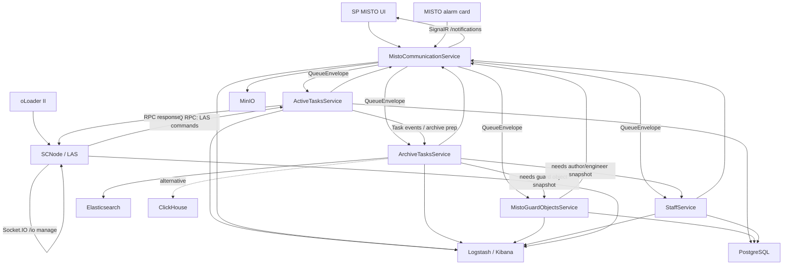
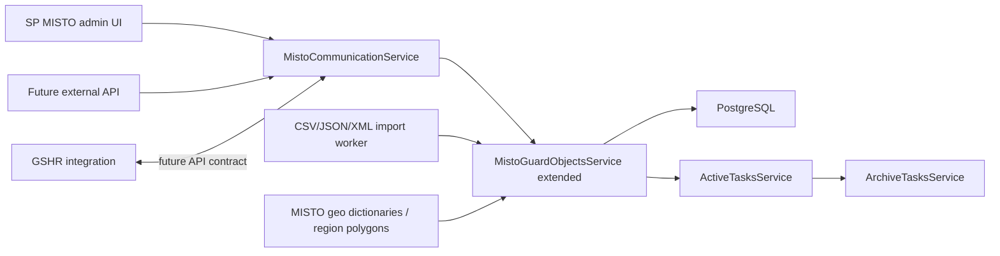
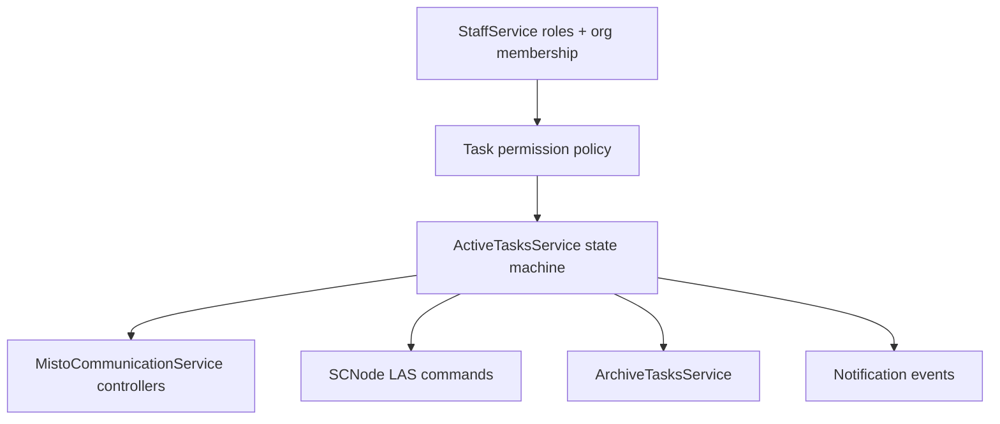
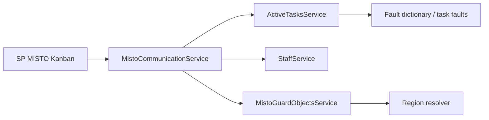
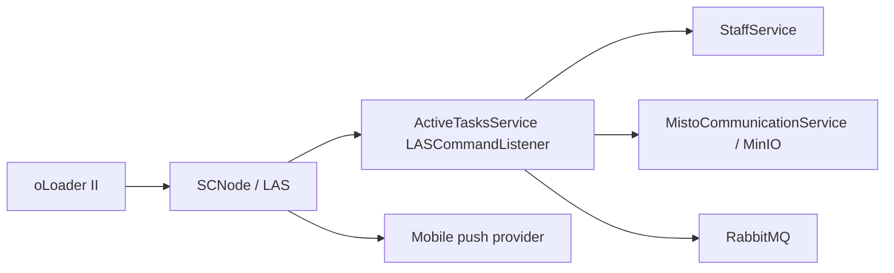
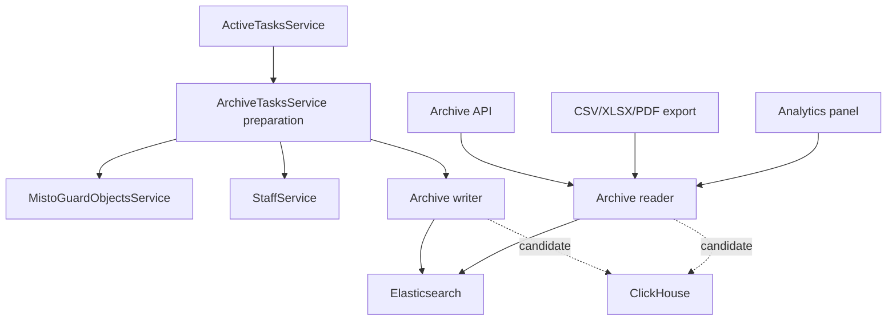

# Детальна карта залежностей Service Center

Дата аналізу: 2026-05-05  
Позначення: `A -> B` означає, що `A` викликає, використовує, деплоїть, тестує або документує `B`.  
Статус: `наявне` - знайдено в коді/документації; `частково` - є основа, але не весь продуктовий сценарій; `майбутнє` - потрібне для описаного функціоналу, але не реалізоване як завершений компонент; `gap` - розходження або рішення, яке треба прийняти.

## 1. Вузли системи

| Вузол | Тип | Статус | Роль |
| --- | --- | --- | --- |
| SP MISTO UI | зовнішній/існуючий продукт | майбутнє для нових екранів | Канбан, створення/редагування заявок, архів, віртуальні об'єкти, управління інженерами |
| MISTO alarm card | зовнішній/існуючий продукт | майбутнє | Автоматичне або операторське створення заявки з картки тривоги |
| oLoader II mobile | зовнішній/існуючий продукт | майбутнє для Service Center UI | Мобільний інтерфейс інженера/старшого інженера |
| SCNode / LAS | Node.js/TypeScript service | наявне, потребує стабілізації | Socket.IO gateway для oLoader II, RabbitMQ RPC до ActiveTasks |
| SCNode_Tests | Jest E2E | наявне, є contract drift | Socket.IO тести для LAS команд |
| MistoCommunicationService | .NET service | наявне | HTTP API для MISTO, SignalR notifications, queue publisher/router, attachments |
| ActiveTasksService | .NET service | наявне | Активні заявки, LAS command processing, cache, DB sync, archivation trigger |
| ArchiveTasksService | .NET service | наявне/частково | Архівні snapshots, filters, Elasticsearch reader/writer, enrichment workflow |
| MistoGuardObjectsService | .NET service | наявне/частково | MISTO guard objects cache/storage; база для майбутніх virtual objects |
| StaffService | .NET service | наявне/частково | Staff registry, roles, TirasCloud/MISTO identity links, join requests |
| modMessageBrokers | .NET shared module | наявне | RabbitMQ queues, publishers, routers, envelope converters |
| modFileStorageCore | .NET shared module | наявне | MinIO attachments, signed/public URLs, upload queue |
| PostgreSQL | platform dependency | наявне | Relational persistence для active tasks, staff, guard objects |
| RabbitMQ | platform dependency | наявне | RPC LAS/ATM і міжсервісні queues SCNet |
| Elasticsearch | platform dependency | наявне | Archive search і logs backend |
| ClickHouse | platform dependency/module | частково | Альтернативний archive backend для великих аналітичних читань |
| MinIO | platform dependency | наявне | Фото/документи/вкладення |
| Logstash/Kibana | platform dependency | наявне | Централізовані логи й діагностика |
| SCInfrastructure | GitOps/CI/CD repo | наявне | Jenkins pipelines, Helm charts, Argo CD ApplicationSets |
| SCDocs | docs repo | наявне | Protocol, infrastructure, VPN, Kubernetes runbooks |

## 2. High-level runtime graph

## 3. Наявні runtime edges

| From | To | Статус | Contract / evidence | Нотатки |
| --- | --- | --- | --- | --- |
| oLoader II | SCNode | наявне | Socket.IO path `/io`, event `manage`, ack response | Mobile Service Center UI ще майбутній, але gateway існує. |
| SCNode | RabbitMQ | наявне | `RabbitMQAdapter`, `RabbitMQFacade`, RPC request/reply queues | `CommandCreator` треба виправити для повного payload. |
| SCNode | ActiveTasksService | частково | LAS commands через RabbitMQ: `GET_ORGANIZATION_LIST`, `TAKE_TASK` тощо | Runtime dependency inferred через RabbitMQ, не compile-time. |
| ActiveTasksService | SCNode | частково | `ASSIGN_TASK` command/notification path | Потрібна повна push notification matrix. |
| SCNode_Tests | SCNode | наявне/gap | Jest Socket.IO tests | Тести використовують скорочені action names, код - повні command names. |
| SP MISTO | MistoCommunicationService | наявне для API основи | Контрольlers: `/tasks`, `/archivetasks`, `/mistoguardobjects`, `/staff` | Нові UI сценарії ще мають бути реалізовані в SP MISTO. |
| MistoCommunicationService | ActiveTasksService | наявне | `ActiveTasksQueue`, `TaskPayloads`, `IHttpActiveTasksHandler` | Commands/events для створення, оновлення, призначення, comments, deadlines, faults. |
| MistoCommunicationService | ArchiveTasksService | наявне | `GetArchiveTasksRequested` | Archive GET зараз асинхронно публікується в queue. |
| MistoCommunicationService | MistoGuardObjectsService | наявне | `MistoGuardObjectsQueue`, guard object payloads | Покриває MISTO guard objects, не повну virtual objects базу. |
| MistoCommunicationService | StaffService | наявне | `StaffQueue`, staff payloads | Staff updates і join requests. |
| MistoCommunicationService | MinIO | наявне | `IFileStorage`, `MinioFileStorage`, attachments endpoints | Потрібне рішення для mobile direct/signed uploads. |
| MistoCommunicationService | SP MISTO | наявне | SignalR hub `/notifications` | Push-back у MISTO grouped by organization. |
| ActiveTasksService | PostgreSQL | наявне | `DatabaseTaskStorageService`, `ActiveTaskDbContext` | Потрібен sequence/identity замість temporary IDs. |
| ActiveTasksService | ArchiveTasksService | наявне/частково | `ArchivationTaskService`, `ActiveTaskPartPrepareToArchiveBulk` | Enrichment і final archive flow треба довести до acceptance. |
| ActiveTasksService | MistoCommunicationService | наявне | queue response publication | Для realtime MISTO updates. |
| MistoGuardObjectsService | PostgreSQL | наявне | `DatabaseGuardObjectStorageService` | Має aggregate address/device/notes/owner. |
| MistoGuardObjectsService | ArchiveTasksService | наявне/частково | `GuardObjectPartPrepareToArchive`, `GetMistoGuardObjectForArchive` | Потрібне snapshot enrichment для virtual objects також. |
| StaffService | PostgreSQL | наявне | `StaffStorageService`, `JoinRequestsStorageService` | Основа для role identity і join request flow. |
| StaffService | ArchiveTasksService | наявне/частково | `EngineerPartPrepareToArchive`, `AuthorPartPrepareToArchive` | Потрібне узгодження snapshot моделі користувача. |
| ArchiveTasksService | Elasticsearch | наявне | `ElasticSearchTaskArchive`, index config | Sorting частково не застосований за readme. |
| ArchiveTasksService | ClickHouse | частково | `modArchiveClickHouse` | Є модуль, сервіс зараз використовує Elasticsearch. |

## 4. Build, deploy, docs edges

| From | To | Статус | Evidence / notes |
| --- | --- | --- | --- |
| `SCNet/feature/k8s` | Jenkins `SCNet_feature_pipeline_job` | наявне | Builds five Docker images. |
| Jenkins | Docker Hub | наявне | `tiras12/scnet-feature-*:b<BUILD_NUMBER>-g<SHA12>`. |
| Jenkins | `SCInfrastructure/argocd-feature` | наявне | Updates `apps/scnet-feature/*/charts/values.image.yaml`. |
| `SCInfrastructure/argocd-feature` | Argo CD | наявне | `apps/scnet-feature/app.yaml` ApplicationSets. |
| Argo CD | Kubernetes namespace `scnet-feature` | наявне | Deploys config + five SCNet services. |
| SCNet services | Platform services | наявне | PostgreSQL, RabbitMQ, MinIO, Elasticsearch, Logstash from existing cluster. |
| `SCInfrastructure/apps/las` | SCNode | наявне/legacy | Helm chart для `tiras12/las`; ще не clearly integrated у `scnet-feature`. |
| `SCDocs` | SCNet/SCInfrastructure | наявне | Protocol and runbooks. |
| `C:\work\dependency-map.md` | all repos | наявне | Cross-project dependency snapshot, updated 2026-05-04. |

## 5. Наявний project graph SCNet

### Services

| Service | Direct internal dependencies | Runtime dependencies |
| --- | --- | --- |
| `ActiveTasksService` | `DatabaseMigrator`, `modActiveTasksCore`, `modActiveTasksDataStore`, `modClientModels`, logger, brokers | RabbitMQ, PostgreSQL, Logstash |
| `ArchiveTasksService` | `modArchiveELK`, `modArchiveMappers`, `modArchiveTasksContracts`, logger, brokers | RabbitMQ, Elasticsearch, Logstash |
| `MistoCommunicationService` | active/archive/file/staff/misto-communication contracts/core, brokers, logger, file storage | RabbitMQ, MinIO, SignalR, JWT, Logstash |
| `MistoGuardObjectsService` | `DatabaseMigrator`, guard object contracts/core/datastore, logger, brokers | RabbitMQ, PostgreSQL, Logstash |
| `StaffService` | `DatabaseMigrator`, staff datastore, brokers, logger | RabbitMQ, PostgreSQL, Logstash |
| `ServiceCenterHostOrchester` | all five services | Local Aspire/debug orchestration |

### Shared domain modules

| Module | Depends on | Роль |
| --- | --- | --- |
| `modActiveTasksCore` | `modActiveTaskContracts` | Cache, handlers, LAS processor, current task business logic |
| `modActiveTasksDataStore` | `modActiveTasksCore`, `modArchiveTasksContracts` | PostgreSQL persistence для active tasks |
| `modArchiveMappers` | active task, archive, guard object, staff contracts | Snapshot mapping |
| `modArchiveELK` | archive contracts | Elasticsearch archive implementation |
| `modArchiveClickHouse` | archive contracts | ClickHouse archive implementation candidate |
| `modMistoCommunicationCore` | active task, brokers, MCS contracts, staff roles | HTTP -> queue і SignalR routing logic |
| `modMistoGuardObjectsCore` | guard object contracts | Guard object cache/business layer |
| `modMistoGuardObjectsDataStore` | guard object contracts | PostgreSQL storage |
| `modStaffCore` | staff contracts, staff roles | Staff register і join requests |
| `modStaffDataStore` | staff core | PostgreSQL storage |
| `modMessageBrokers` | client models, broker contracts, payloads, MCS contracts | RabbitMQ implementation |
| `modMessageBrokersPayloads` | active/archive/client/guard/staff models | Shared event payload contracts |
| `modFileStorageCore` | client models, file storage contracts | MinIO storage implementation |

## 6. Майбутня functional dependency map

### 6.1. Virtual third-party object base

Потрібні нові dependencies:

- `MonitoringSystem` entity: name, owner organization, source type, import/API settings.
- `VirtualGuardObject` entity: panel number, name, free-text address, contacts, optional coordinates/device model, source marker.
- Import validation pipeline: required fields, parse errors, duplicate panel numbers, upsert за panel number per system.
- Region resolver: coordinates -> polygon -> region filter.
- Source marker propagated в `ActiveTaskItem`, LAS responses, MISTO task card, archive `TaskSnapshot`.
- GSHR call contract, якщо підтверджено.

Gaps:

- Наявний `MistoGuardObjectsService` MISTO-object oriented і використовує MistoId/InstanceKey; virtual systems потребують parallel identity model.
- Requirements mention API import як питання, а не committed scope.
- Address є free-text у virtual object requirements, тоді як current guard object aggregate має relational address hierarchy.

### 6.2. Task workflow and permissions

Потрібні dependencies:

- Central state machine library або service-local policy в ActiveTasks.
- Role і membership lookup зі StaffService для admin/operator/senior engineer/engineer.
- Permission enforcement на backend, не лише UI.
- Event publication для assignment, comments, fault changes, deadline/postpone changes, delete/complete.

Gaps:

- Product statuses і current protocol statuses не повністю збігаються.
- `Deleted` status потрібний продукту, але його немає в current LAS enum.
- Current `ActiveTaskItem.Status` є `int`; central enum не знайдено.

### 6.3. SP MISTO Kanban

Dependencies:

- Active task queries by status, organization, engineer, fault type, region.
- Staff counters by engineer.
- Guard object coordinates і region/polygon resolver.
- Fault dictionary normalization для standard/custom faults.
- MISTO UI sorting state і visible filter indicator.

Gaps:

- ActiveTasks cache має status/engineer indices, але region/fault filters залежать від guard object і fault models.
- Region filtering потребує polygon data і clear fallback, коли coordinates missing.

### 6.4. oLoader II Service Center

Dependencies:

- `SCNode` Socket.IO event contract.
- RabbitMQ RPC queues aligned із ActiveTasks LASCommandListener.
- Staff join request endpoints/commands.
- File access decision: LAS proxy vs signed MinIO URL через MCS.
- Push provider integration.

Gaps:

- Current `SCNode_Tests` action names shortened, тоді як SCNode enum і SCNet protocol require full names.
- Current `CommandCreator` omits task/fault/comment fields.
- Protocol має open question, чи всі files мають проходити через LAS.
- Лише `ASSIGN_TASK` incoming server command представлена в SCNode.

### 6.5. Archive and statistics

Dependencies:

- Immutable `TaskSnapshot`, який містить task, guard object, source system, contacts, device, faults, comments, attachments, author, engineer, history і duration.
- Archive filters/sorts aligned із product columns.
- Export service або endpoint.
- Index templates/mappings для comments, nested faults, region, dates, duration.

Gaps:

- Elasticsearch implementation builds filters, але sort application noted як future work.
- Export і analytics panel відсутні.
- Потрібен final choice або split strategy для Elasticsearch vs ClickHouse.

## 7. Protocol and contract dependencies

| Contract | Current source | Consumers | Gaps |
| --- | --- | --- | --- |
| LAS command names | `SCNet/modActiveTaskContracts/LASContracts/LASCommandTypes.cs`, `SCNode/src/interfaces/enums/commands.enum.ts`, `SCDocs/protocol.md` | SCNode, ActiveTasks, SCNode_Tests, oLoader | SCNode_Tests shortened names; `GET_ENGINEER_TASKS` appears in examples but not in formal command list in the same way. |
| LAS message envelope | `LASCommandEnvelope`, `LASResponseEnvelope`, SCNode `BasicCommand` | SCNode, ActiveTasks | Треба verify correlationId/replyTo behavior end-to-end. |
| Task status | product doc, `SCNode TaskStatus`, `ActiveTaskItem.Status int` | all UIs, ActiveTasks, Archive | Потрібен single enum і migration map. |
| Queue event actions | `QueueДіяType.cs` | SCNet services | Good base, але future notifications/delete/comment edit/file events потребують explicit coverage. |
| Archive filter/sort | `modArchiveTasksContracts` | ArchiveTasksService, MCS archive endpoint, future UI/export | Sorting не fully implemented в Elasticsearch adapter. |
| Staff roles | `modStafContracts`, `modStaffRoles`, product role table | StaffService, ActiveTasks permissions, UI | Потрібна machine-readable permission matrix. |
| Guard object model | `modMistoGuardObjectsContracts`, `modClientModels.GuardObjects` | MCS, GOS, Archive | Потрібне virtual object/source system extension. |

## 8. Data dependencies

| Data | Кандидат-власник | Used by | Persistence | Нотатки |
| --- | --- | --- | --- | --- |
| Active task | ActiveTasksService | MISTO, oLoader, Archive | PostgreSQL + in-memory cache | Core mutable aggregate до archive. |
| Task status history | ActiveTasksService | MISTO card, archive, audit | PostgreSQL/snapshot | Потребує mandatory audit rules. |
| Faults | ActiveTasksService або dictionary source | Active tasks, archive filters, analytics | PostgreSQL/snapshot | Standard/custom split існує; dictionary source потребує decision. |
| Guard object | MistoGuardObjectsService | Active tasks, archive, filters | PostgreSQL/cache | Existing MISTO object model. |
| Virtual guard object | MistoGuardObjectsService extended | Active tasks, archive, MISTO UI | PostgreSQL/cache | Future. |
| Monitoring system/source | MistoGuardObjectsService extended | Active tasks, archive, filters | PostgreSQL | Future. |
| Staff member | StaffService | assignment, permissions, archive snapshot | PostgreSQL/cache | Includes TirasCloud і MISTO credentials. |
| Join request | StaffService | oLoader, SP MISTO engineer management | PostgreSQL/cache | Existing model добре maps to mobile requirement. |
| Attachments | MistoCommunicationService/modFileStorageCore | task card, archive, mobile | MinIO + task references | Потрібне immutable/archive behavior decision. |
| Archive snapshot | ArchiveTasksService | archive table, export, analytics | Elasticsearch або ClickHouse | Не має змінюватися після object changes. |
| Region polygons | TBD | Kanban/archive filters | TBD | Future dependency; подібно до air-alert logic за requirement. |

## 9. Test dependencies

| Test layer | Поточний стан | Потрібні additions |
| --- | --- | --- |
| SCNet unit tests | ActiveTasks, brokers, guard objects, staff tests exist | State machine, permissions, duplicate folding, archive enrichment |
| SCNode unit/integration tests | Jest exists для 13 Socket.IO flows | Rename actions або add compatibility adapter; assert full payload reaches RabbitMQ |
| Cross-service contract tests | Not clearly present | SCNode -> RabbitMQ -> ActiveTasks command/response; MCS -> queues -> services |
| Deploy smoke tests | Documented as desired | Health, RabbitMQ, PostgreSQL, MinIO, Elasticsearch, SignalR/Socket.IO |
| Archive tests | Module tests not fully observed | Filter/sort/pagination/export, nested comment/fault search |
| Security tests | Not observed | AuthZ by role/status/action; secret scanning; forbidden transition tests |

## 10. Critical dependency risks

| Ризик | Вплив | Рекомендоване пом’якшення |
| --- | --- | --- |
| Status/role model divergence | UI і backend можуть disagree щодо allowed actions | Create central status/action/role contract і enforce в ActiveTasks. |
| LAS naming drift | E2E tests можуть pass against wrong contract або fail після deployment | Normalize names, add compatibility лише якщо intentionally supported. |
| SCNode payload truncation | Commands як `TAKE_TASK`, `ADD_COMMENT_TO_TASK`, faults не можуть працювати correctly | Fix `CommandCreator`, щоб preserve command-specific payload. |
| Virtual objects identity model absent | Third-party object base не можна safe add поверх лише MistoId | Add explicit `MonitoringSystem` і `VirtualGuardObject` model. |
| Archive backend uncertainty | Analytics/export may require rework | Decide MVP backend і document, коли вводиться ClickHouse. |
| Secrets in GitOps | Blocks production-grade rollout | Move to encrypted/managed secrets перед staging/prod. |
| SCNode deploy separate from SCNet feature contour | Backend може deploy без matching LAS gateway | Add LAS chart/pipeline в integrated feature smoke flow. |
| Async queue-only APIs for UI queries | MISTO archive/kanban можуть потребувати synchronous reads | Decide per endpoint: command/async vs query/sync. |

## 11. Рекомендований dependency ordering

1. Contract foundation: statuses, command schemas, permissions, payload shape.
2. Delivery foundation: SCNet + SCNode smoke в одному testable environment.
3. ActiveTasks state machine і persistence correctness.
4. Staff join requests і role membership.
5. MISTO task API/Kanban і oLoader core commands.
6. Guard object source expansion для virtual third-party systems.
7. Archive snapshot enrichment і search.
8. Export/analytics/push notification expansion.
9. Production rollout hardening.
