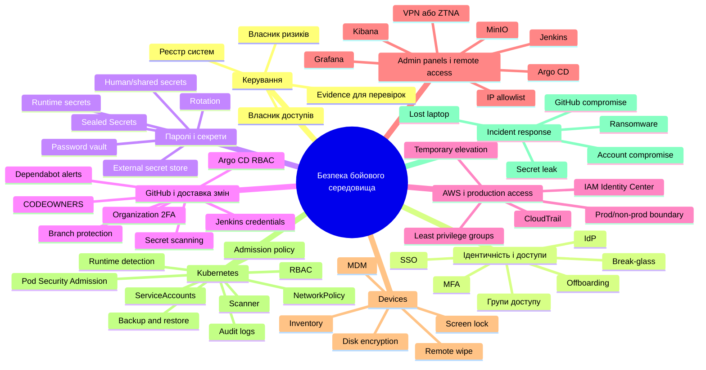

# Kubernetes security mind map

Статус: canonical working document  
Оновлено: 2026-05-13  
Джерела: `archive/2026-05-13/KUBERNETES_SECURITY_MIND_MAP v2.md` як primary source, `archive/2026-05-13/KUBERNETES_SECURITY_MIND_MAP v1.md` як gap/coverage reference, `archive/2026-05-13/security_tool_decision_matrix_v0_1.xlsx` як resource artifact.

## Призначення

Цей документ розкладає "безпеку Kubernetes" на практичні шари для малої DevOps-adjacent команди. Головний висновок з approved source: Kubernetes не є стартовим центром усієї безпеки. Він має бути зміцнений, але найбільше зниження ризику зараз дають identity, MFA, password vault, GitHub hardening, AWS logging, admin panel access, device basics і restore evidence.

Документ не є team-ready audit evidence. Live-state facts треба перевірити перед використанням для production decision або promotion у team docs.

## Короткий висновок

У vanilla Kubernetes немає одного прямого аналога "Active Directory for Kubernetes". Kubernetes приймає authenticated identity і застосовує RBAC, але не керує життєвим циклом людей, MFA, пристроями, offboarding, password vault, GitHub governance, AWS IAM або incident response.

Для поточного масштабу найкраща модель:

```text
IdP + MFA -> password vault -> GitHub hardening -> AWS logging/groups -> protected admin panels -> Kubernetes RBAC/PSA/secrets -> restore-tested backups
```

Kubernetes work залишається P0/P1, але не має підміняти базові controls навколо доступів і зміни коду.

## Загальна ментальна карта



## Межа Kubernetes

| Сфера | Що покриває Kubernetes | Що поза Kubernetes | Пріоритет зараз |
| --- | --- | --- | --- |
| Human identity | Приймає authenticated user/group і застосовує RBAC. | IdP, SSO, MFA, device posture, joiner/mover/leaver process. | P0 |
| Kubernetes authorization | `Role`, `ClusterRole`, bindings, `SubjectAccessReview`, `kubectl auth can-i`. | Business approval, access request workflow, periodic access review. | P0 |
| Workload identity | `ServiceAccount`, projected tokens, audience-bound tokens. | Cloud IAM, CI identity, cross-system service accounts. | P1 |
| Secrets | `Secret` delivery into Pods, encryption at rest if configured. | Source of truth, rotation, password vault, dynamic credentials. | P0/P1 |
| Admission and posture | Native admission, Pod Security Admission, `ValidatingAdmissionPolicy`, webhooks. | Policy ownership, exceptions, compliance interpretation. | P1 |
| Network isolation | `NetworkPolicy` if CNI enforces it. | VPN, ZTNA, firewall, NAT, DNS, WAF, external exposure. | P0/P1 |
| Audit | Kubernetes API audit events if enabled. | SIEM/log retention, IdP/AWS/GitHub audit, investigation workflow. | P1 |
| Supply chain | Admission gates for images/manifests and registry references. | GitHub rules, CI hardening, registry policy, SBOM/provenance/signing. | P0/P1 |
| Recovery | Declarative manifests, etcd/control-plane backups, operator backups. | Off-cluster storage, DB restore, GitHub/docs/password vault backup, DR ownership. | P0 |

## Рівні впровадження

| Рівень | Фокус | Мінімальний результат |
| --- | --- | --- |
| 0 | Inventory і owners | Таблиця systems/admin panels/access owners; визначений власник доступів. |
| 1 | Identity, MFA, password vault | Адміністратори з MFA; пілот password vault; заборона паролів у чатах. |
| 2 | GitHub і delivery path | Organization 2FA, branch protection, required review/status checks, CODEOWNERS для critical paths, secret scanning, Dependabot alerts. |
| 3 | AWS і production access | CloudTrail як процес, групи доступу, мінімізація full-admin прав, documented manual changes, temporary elevation. |
| 4 | Admin panels і remote access | Jenkins/Argo CD/Grafana/Kibana/MinIO/RabbitMQ закриті SSO/MFA або private access, external exposure inventory оновлений. |
| 5 | Kubernetes baseline | RBAC enforced, roles described, Argo CD RBAC/SSO path, PSA, NetworkPolicy, Sealed Secrets, audit logs. |
| 6 | Detection, response, restore | Restore drill evidence, incident mini-runbooks, audit query path, first scanner/runtime pilot. |

## Kubernetes baseline checklist

| Блок | Обов'язковий мінімум | Кандидати або evidence |
| --- | --- | --- |
| API і авторизація | RBAC + Node authorizer; no uncontrolled `AlwaysAllow`. | MicroK8s RBAC evidence, `kubectl auth can-i`. |
| Людський доступ | Доступ через групи/ролі, не через shared або хаотичні kubeconfigs. | IdP/OIDC, Rancher, Teleport, Azure Arc, controlled kubeconfig inventory. |
| ServiceAccounts | Окремі accounts для workloads і automation, least privilege. | ServiceAccount/RBAC inventory. |
| Namespaces | Розділення system, apps, databases, observability, operators. | Namespace inventory і ownership. |
| Pod hardening | `baseline`/`restricted` posture, no privileged/root by default. | Pod Security Admission, exception register. |
| Admission policy | Заборона risky manifests через один primary policy layer. | Kyverno, Gatekeeper або narrow native `ValidatingAdmissionPolicy`. |
| Network isolation | Default-deny для critical/new namespaces і allowlist потоків. | Calico/CNI enforcement evidence, NetworkPolicy inventory. |
| Secrets | No plaintext runtime secret values in Git. | Approved current workflow: Sealed Secrets; later ESO/external store if justified. |
| Images | Vulnerability/posture reports для images і manifests. | Trivy Operator, Kubescape, registry scanner. |
| Audit | Хто/коли/що змінив у cluster. | API audit policy, log destination, retention, query example. |
| Backup | Control plane objects, volumes, DBs, Sealed Secrets controller key. | Velero/DB-native backups, restore drill result. |
| Operators | Operators мають мінімальні permissions і documented blast radius. | Operator RBAC review. |

## Атоми для порівняння інструментів

Порівнювати не "бренд проти бренду", а coverage за atoms:

| Atom                      | Що питати                                                 | Поточний gap                                                                  |
| ------------------------- | --------------------------------------------------------- | ----------------------------------------------------------------------------- |
| Identity source of truth  | Хто є authoritative user directory?                       | Long-term IdP не затверджений.                                                |
| MFA / Conditional Access  | Чи можна заблокувати weak login або unmanaged device?     | Потрібен фактичний IdP/device posture.                                        |
| Kubernetes authentication | Як user отримує доступ до API?                            | Current auth path треба перевірити по clusters.                               |
| RBAC enforcement          | Чи access denied by default?                              | Потрібна fresh host-level перевірка authorization mode.                       |
| Human role model          | Які ролі потрібні команді?                                | Треба затвердити Viewer/Troubleshooter/Developer/Platform/Secret/Break-glass. |
| ServiceAccount hygiene    | Чи workload tokens least-privilege і bounded?             | Немає inventory service accounts і bindings.                                  |
| Kubeconfig hygiene        | Чи є personal/shared kubeconfigs?                         | Немає register активних kubeconfigs.                                          |
| Break-glass               | Як зайти при втраті SSO/GitOps/control plane?             | Не затверджено holders і drill schedule.                                      |
| Secrets in GitOps         | Чи secret values не лежать plaintext у Git?               | Треба перевірити actual `SealedSecret` adoption і key backup.                 |
| Runtime secrets lifecycle | Хто є source of truth і як rotate?                        | Prod model beyond Sealed Secrets не обраний.                                  |
| Pod hardening             | Чи Pods не запускаються privileged/root без причини?      | PSA labels і exception policy треба перевірити.                               |
| Admission policy          | Які manifests можна apply?                                | Треба обрати один primary policy engine.                                      |
| Network isolation         | Чи default-deny і allowlists працюють?                    | Default-deny state невідомий.                                                 |
| Runtime detection         | Чи бачимо suspicious process/network/file behavior?       | Tool не обраний; потрібен low-noise pilot.                                    |
| Vulnerability scanning    | Чи бачимо CVEs в images/nodes/workloads?                  | Немає current scan report baseline.                                           |
| GitOps access             | Хто може змінити desired state?                           | Jenkins/GitOps credential blast radius треба review.                          |
| Audit logging             | Де видно human і automation actions?                      | Audit flags, retention і query path треба verify.                             |
| Backup / restore          | Чи можна відновити cluster, secrets і data?               | Restore drill evidence відсутній або outdated.                                |
| Data/admin access         | Хто має DB/object-storage/admin доступ?                   | Data access model не зведений у matrix.                                       |
| Endpoint/user device      | Чи trusted workstation використовується для admin access? | Потрібен окремий device management track.                                     |

## Coverage matrix для кандидатів

| Кандидат | Покриває | Не покриває | Практичний статус |
| --- | --- | --- | --- |
| Kubernetes native RBAC + PSA + audit + NetworkPolicy | In-cluster authorization, pod posture, API audit, L3/L4 isolation. | IdP/MFA, password vault, external secret lifecycle, runtime detection, GitHub/AWS governance. | Must-have foundation. |
| IdP: Google Workspace / Microsoft Entra / JumpCloud / Okta | Users, groups, SSO/MFA, offboarding anchor. | Kubernetes policy, runtime detection, app-specific secrets. | P0 direction decision. |
| Password manager: 1Password / Bitwarden / Keeper / Passbolt / Vaultwarden / Psono | Human/shared passwords, team vaults, recovery access. | Kubernetes RBAC, pod security, runtime secrets by itself. | Separate P0 track from runtime secrets. |
| GitHub hardening | 2FA, branch protection, required review/status checks, CODEOWNERS, secret/dependency alerts. | Runtime cluster security and AWS IAM. | P0 supply-chain baseline. |
| AWS IAM Identity Center + CloudTrail | Production access groups and audit trail. | Kubernetes authorization and GitHub review gates. | P0/P1 production access baseline. |
| Cloudflare Access / Tailscale / VPN + IP allowlist | Private/admin panel access control and reduced public exposure. | In-cluster RBAC and secret lifecycle. | P0/P1 admin panel protection. |
| Sealed Secrets | Git-friendly encrypted Kubernetes secret manifests. | Human secrets, dynamic secrets, full rotation governance. | Approved current Kubernetes secret workflow. |
| External Secrets Operator + AWS Secrets Manager / Vault / OpenBao | Bridge from external source of truth into Kubernetes `Secret`. | Human identity and password vault. | Target option after baseline maturity. |
| Kyverno / Gatekeeper / `ValidatingAdmissionPolicy` | Admission policy and guardrails. | Runtime detection, IdP, password vault. | Pick one primary layer. |
| Trivy Operator / Kubescape | Vulnerability, posture and compliance reports. | Human access lifecycle and runtime blocking. | First low-overhead scanner candidates. |
| Falco / Tetragon / NeuVector | Runtime event detection and deeper workload visibility. | Identity/password/GitHub governance. | Pilot after baseline noise is understood. |
| Rancher / Teleport / Azure Arc | Access management, roles, SSO/RBAC overlay, audit/session evidence depending on tool. | Full secrets lifecycle, policy ownership, device/security governance. | Candidate after native foundation is real. |

## Перші 10 дій

1. Заборонити передавання паролів у чатах і запустити password vault pilot.
2. Увімкнути MFA для адміністраторів у core systems.
3. Увімкнути 2FA requirement у GitHub organization.
4. Увімкнути branch protection для main/release branches: pull request, review, status checks, no force push.
5. Зробити offboarding checklist для production, GitHub, AWS, VPN, devices і admin panels.
6. Увімкнути CloudTrail як постійний AWS audit process.
7. Закрити Jenkins/Argo CD/Grafana/Kibana/MinIO/RabbitMQ за SSO/MFA або private access.
8. Перевірити і enforce RBAC у MicroK8s/Kubernetes; переглянути всі `cluster-admin` bindings.
9. Провести restore drill для critical DB/data в ізольованому середовищі.
10. Написати короткі incident runbooks: account compromise, lost laptop, secret leak, GitHub compromise, ransomware.

## Що не робити першим

| Напрям | Чому не перший |
| --- | --- |
| Повний Okta-first stack | Може бути сильним, але операційно важчий за потреби малого середовища. |
| RHACS або NeuVector як перший security крок | Не виправляє password sharing, GitHub без branch protection або слабкий offboarding. |
| Повний Vault HA | Потребує зрілого operating model; почати з password vault, Sealed Secrets і простого external secret target. |
| Full privileged session recording | Корисно пізніше, але після MFA/IdP/admin panel protection. |
| Формальна ISO 27001/SOC 2 програма | Поки не required; збирати мінімальне evidence поступово. |

## Needs verification

- Фактичний `authorization-mode` у MicroK8s/Kubernetes clusters.
- External reachability Kubernetes API і admin panels з untrusted network.
- Поточний стан SSO/MFA для GitHub, AWS, Jenkins, Argo CD, Grafana, Kibana, MinIO і RabbitMQ.
- Чи GitHub organization має required 2FA, branch protection, secret scanning і Dependabot alerts.
- Чи CloudTrail увімкнений, multi-region, retained і queryable.
- Чи Sealed Secrets controller встановлений у потрібних clusters, чи є `SealedSecret` adoption і key backup.
- Чи NetworkPolicy default-deny реально enforce-иться CNI.
- Чи є restore drill evidence для critical DB/data і Sealed Secrets controller key.
- Чи password manager shortlist затверджений для human/shared secrets.
- Який first scanner/runtime pilot має прийнятний noise і ownership.
