# Клікабельна ментальна карта та компактна матриця ризиків

Статус: робочий документ для структурування поточного стану безпеки і підготовки Jira Epic з задачами та підзадачами.  
Мова документа: українська. Англійські назви залишені там, де це назви продуктів, технологій або загальновживані скорочення.  
Джерела:

- `C:\work\docs\projects\shared\SECURITY_DISCOVERY_QUESTIONNAIRE.md`
- `C:\Users\pozit\Downloads\Тези про безпеку (Відповідь).md`
- `C:\work\docs\projects\shared\KUBERNETES_SECURITY_MIND_MAP.md`
- `C:\work\docs\projects\shared\incident-reaserch\`

Правила роботи з документом:

- один рядок матриці = один керований ризик або група близьких ризиків, з яких можна створити Jira Task;
- підризики всередині рядка можуть стати Jira Subtask;
- пріоритетність умовна і відображає повторюваність сценаріїв атак у пов'язаних інцидентах, вплив на критичні системи та корисність для першої хвилі робіт;
- колонка `Пов'язані інциденти` залишається окремою evidence-колонкою;
- колонка `Нотатки до рішення` призначена для попередніх ідей, обмежень і гіпотез;
- колонка `Варіанти рішень / обране рішення` призначена для технологій, SaaS-сервісів, чеклистів і фінального вибору;
- колонка `Впровадження / перевірка / залишковий ризик` зберігає короткий операційний стан після роботи над пунктом.

## Як читати ієрархію

```text
Зона ризику -> Загроза, ризик і обсяг -> Пов'язані інциденти -> Рішення -> Перевірка
```

`Зона ризику` поєднує напрям безпеки та конкретну зону, щоб таблиця була компактною в Jira.  
`Загроза, ризик і обсяг` описує проблему, можливі наслідки та підризики, які входять у рядок.  
`Пов'язані інциденти` групує зовнішні приклади за типовим сценарієм атаки.  
`Нотатки до рішення` потрібні для чорнових думок до вибору інструментів або процесу.  
`Варіанти рішень / обране рішення` відокремлює список кандидатів від фінального рішення.  
`Впровадження / перевірка / залишковий ризик` показує, що реально зроблено, як перевірено і що лишилось прийнятим ризиком.

## Реєстр зон ризику

<table>
  <tr>
    <td width="50%" valign="top">
      <strong><a href="#access-lifecycle">Керування доступами</a></strong><br>
      <a href="#access-lifecycle">Життєвий цикл доступів</a><br>
      <a href="#access-mfa">MFA для критичних акаунтів</a><br>
      <a href="#access-shared-accounts">Паролі людей і shared credentials</a>
    </td>
    <td width="50%" valign="top">
      <strong><a href="#secrets-runtime-ci">Секрети та облікові дані</a></strong><br>
      <a href="#secrets-runtime-ci">Секрети в Git, runtime і CI/CD</a><br>
      <a href="#cloud-service-credentials">Облікові дані хмари та сервісів</a><br>
      <a href="#critical-crypto-keys">Критичні криптографічні ключі</a>
    </td>
  </tr>
  <tr>
    <td width="50%" valign="top">
      <strong><a href="#delivery-control">GitHub, CI/CD і ланцюг постачання ПЗ</a></strong><br>
      <a href="#delivery-control">GitHub і доставка змін</a><br>
      <a href="#delivery-supply-chain-scanning">Сканування та supply chain</a><br>
      <a href="#devices-developer-tools">Робочі станції розробників</a>
    </td>
    <td width="50%" valign="top">
      <strong><a href="#prod-control-plane">Бойове середовище і Kubernetes</a></strong><br>
      <a href="#prod-control-plane">Nginx, PM2, admin UI і ручні зміни</a><br>
      <a href="#k8s-access-control">Доступ до Kubernetes</a><br>
      <a href="#k8s-traffic-control">Трафік у Kubernetes</a>
    </td>
  </tr>
  <tr>
    <td width="50%" valign="top">
      <strong><a href="#cloud-audit-boundary">Хмара та приватний доступ</a></strong><br>
      <a href="#cloud-audit-boundary">CloudTrail і межі середовищ</a><br>
      <a href="#private-access-admin-surfaces">VPN, internal panels, SSH/RDP і public exposure</a>
    </td>
    <td width="50%" valign="top">
      <strong><a href="#data-critical-db">Дані, файли та документи</a></strong><br>
      <a href="#data-critical-db">Критичні дані</a><br>
      <a href="#data-firmware-storage">Файли та firmware</a><br>
      <a href="#data-documents-local-copies">Документи й локальні копії</a>
    </td>
  </tr>
  <tr>
    <td width="50%" valign="top">
      <strong><a href="#logs-observability-tamper">Журнали та сповіщення</a></strong><br>
      <a href="#logs-observability-tamper">Журнали й спостереження</a><br>
      <a href="#alerts-ownership-routing">Сповіщення безпеки</a>
    </td>
    <td width="50%" valign="top">
      <strong><a href="#devices-basic-state">Пристрої співробітників</a></strong><br>
      <a href="#devices-basic-state">Базовий стан пристроїв</a>
    </td>
  </tr>
  <tr>
    <td width="50%" valign="top">
      <strong><a href="#backup-recovery-readiness">Резервні копії та реагування</a></strong><br>
      <a href="#backup-recovery-readiness">Резервні копії та відновлення</a><br>
      <a href="#incident-response-readiness">Реагування на інциденти</a>
    </td>
    <td width="50%" valign="top">
      <strong><a href="#docs-ai-context-exposure">Документація та управління безпекою</a></strong><br>
      <a href="#docs-ai-context-exposure">Репозиторії, документація й AI-контекст</a><br>
      <a href="#security-governance-workflows">Управління безпекою</a>
    </td>
  </tr>
</table>

## Ментальна карта

> Ментальна карта показує вже об'єднані ризики. Детальні старі підризики збережені як HTML-якорі всередині рядків матриці.

```mermaid
%%{init: {"securityLevel": "loose", "flowchart": {"htmlLabels": true}}}%%
flowchart LR
  root["Поточний стан кібербезпеки"]

  root --> access["Керування доступами"]
  access --> access_lifecycle["Життєвий цикл доступів"]
  access --> access_mfa["MFA для критичних акаунтів"]
  access --> access_shared["Паролі людей і shared credentials"]

  root --> secrets["Секрети та облікові дані"]
  secrets --> secrets_runtime["Секрети в Git, runtime і CI/CD"]
  secrets --> cloud_credentials["Облікові дані хмари та сервісів"]
  secrets --> crypto_keys["Критичні криптографічні ключі"]

  root --> delivery["GitHub, CI/CD і ланцюг постачання ПЗ"]
  delivery --> delivery_control["GitHub і доставка змін"]
  delivery --> delivery_scanning["Сканування та supply chain"]
  delivery --> developer_tools["Робочі станції розробників"]

  root --> platform["Бойове середовище і Kubernetes"]
  platform --> prod_control["Бойове середовище"]
  platform --> k8s_access["Доступ до Kubernetes"]
  platform --> k8s_traffic["Трафік у Kubernetes"]

  root --> cloud_private["Хмара та приватний доступ"]
  cloud_private --> cloud_audit["CloudTrail і межі середовищ"]
  cloud_private --> private_access["VPN, internal panels, SSH/RDP"]

  root --> data["Дані, файли та документи"]
  data --> data_db["Критичні дані"]
  data --> data_files["Файли та firmware"]
  data --> data_docs["Документи й локальні копії"]

  root --> logs["Журнали та сповіщення"]
  logs --> logs_observability["Журнали й спостереження"]
  logs --> alerts["Сповіщення безпеки"]

  root --> devices["Пристрої співробітників"]
  devices --> devices_base["Базовий стан пристроїв"]

  root --> resilience["Резервні копії та реагування"]
  resilience --> backups["Резервні копії та відновлення"]
  resilience --> response["Реагування на інциденти"]

  root --> governance["Документація та управління безпекою"]
  governance --> docs_ai["Репозиторії, документація й AI-контекст"]
  governance --> gov_workflows["Управління безпекою"]

  click access_lifecycle "#access-lifecycle" "Перейти до ризику"
  click access_mfa "#access-mfa" "Перейти до ризику"
  click access_shared "#access-shared-accounts" "Перейти до ризику"
  click secrets_runtime "#secrets-runtime-ci" "Перейти до ризику"
  click cloud_credentials "#cloud-service-credentials" "Перейти до ризику"
  click crypto_keys "#critical-crypto-keys" "Перейти до ризику"
  click delivery_control "#delivery-control" "Перейти до ризику"
  click delivery_scanning "#delivery-supply-chain-scanning" "Перейти до ризику"
  click developer_tools "#devices-developer-tools" "Перейти до ризику"
  click prod_control "#prod-control-plane" "Перейти до ризику"
  click k8s_access "#k8s-access-control" "Перейти до ризику"
  click k8s_traffic "#k8s-traffic-control" "Перейти до ризику"
  click cloud_audit "#cloud-audit-boundary" "Перейти до ризику"
  click private_access "#private-access-admin-surfaces" "Перейти до ризику"
  click data_db "#data-critical-db" "Перейти до ризику"
  click data_files "#data-firmware-storage" "Перейти до ризику"
  click data_docs "#data-documents-local-copies" "Перейти до ризику"
  click logs_observability "#logs-observability-tamper" "Перейти до ризику"
  click alerts "#alerts-ownership-routing" "Перейти до ризику"
  click devices_base "#devices-basic-state" "Перейти до ризику"
  click backups "#backup-recovery-readiness" "Перейти до ризику"
  click response "#incident-response-readiness" "Перейти до ризику"
  click docs_ai "#docs-ai-context-exposure" "Перейти до ризику"
  click gov_workflows "#security-governance-workflows" "Перейти до ризику"
```



## Матриця ризиків

| Зона ризику | Загроза, ризик і обсяг | Пріоритетність | Пов'язані інциденти | Стан роботи | Нотатки до рішення | Варіанти рішень / обране рішення | Впровадження / перевірка / залишковий ризик |
| --- | --- | --- | --- | --- | --- | --- | --- |
| <a id="access-lifecycle"></a><a id="access-idp-source"></a><a id="access-offboarding"></a><a id="access-manual"></a>Керування доступами / життєвий цикл доступів | Немає централізованого контролю життєвого циклу доступів. Доступи видаються вручну, не завжди прив'язані до ролей, груп і offboarding-процесу; колишній співробітник або скомпрометований акаунт може зберегти доступ до окремого сервісу. Обсяг: IdP/SSO, ручна видача доступів, перегляд ролей, offboarding. | Висока | **Залишені або надмірні доступи:** [Block / Cash App Investing](incident-reaserch/access-offboarding-incident-research.md), [Shopify - rogue support employees](incident-reaserch/access-manual-incident-research.md), [Twitter - компрометація внутрішніх admin tools](incident-reaserch/access-manual-incident-research.md) — показують ризик довгоживучих або надмірних доступів.<br>**SaaS та support-доступи:** [Okta / Sitel](incident-reaserch/access-idp-source-incident-research.md), [Okta support case management](incident-reaserch/access-idp-source-incident-research.md), [Qantas](incident-reaserch/access-idp-source-incident-research.md), [Salesloft Drift](incident-reaserch/access-idp-source-incident-research.md), [ADT](incident-reaserch/access-idp-source-incident-research.md) — показують, що обліковий запис або інтеграція підтримки може відкрити клієнтський контекст. | Уточнити |  | Кандидати:<br>Обране: | Впровадження:<br>Перевірка / докази:<br>Залишковий ризик: |
| <a id="access-mfa"></a><a id="delivery-github-mfa"></a>Керування доступами / MFA для критичних акаунтів | Неповне MFA-покриття для критичних акаунтів і GitHub. Компрометація пароля або сесії може відкрити GitHub, хмару, адмін-панелі, VPN або сервіси з доступом до бойового середовища. Обсяг: MFA для робочих сервісів, GitHub-акаунтів, VPN і privileged access. | Висока | **Компрометація акаунтів і MFA-bypass:** [Uber - MFA fatigue](incident-reaserch/access-mfa-incident-research.md), [Twilio - smishing](incident-reaserch/access-mfa-incident-research.md), [Colonial Pipeline - VPN account without MFA](incident-reaserch/access-mfa-incident-research.md), [CircleCI - stolen 2FA-backed session](incident-reaserch/delivery-github-mfa-incident-research.md) — показують, що MFA має бути обов'язковою і стійкою до фішингу.<br>**GitHub і developer endpoint:** [GitHub - poisoned VS Code extension](incident-reaserch/access-mfa-incident-research.md), [OpenAI - TanStack npm attack impact](incident-reaserch/delivery-github-mfa-incident-research.md) — показують, що MFA не закриває ризик сесій і endpoint-компрометації повністю. | Дослідити |  | Кандидати:<br>Обране: | Впровадження:<br>Перевірка / докази:<br>Залишковий ризик: |
| <a id="access-shared-accounts"></a><a id="secrets-chat"></a><a id="secrets-shared-prod"></a>Паролі людей / shared credentials і персональна відповідальність | Shared credentials, паролі в чатах і відсутність персональної відповідальності. Один пароль або спільний логін може дати доступ до critical services, а після інциденту складно встановити виконавця дії й правильно відкликати доступ. Обсяг: password manager, спільні логіни, shared prod/admin passwords, персональні облікові записи. | Висока | **Shared або повторно використані credentials:** [Oldsmar Water Facility](incident-reaserch/secrets-shared-prod-incident-research.md), [Colonial Pipeline](incident-reaserch/secrets-shared-prod-incident-research.md), [CISA - Oracle Cloud credential risks](incident-reaserch/secrets-shared-prod-incident-research.md) — показують, що один слабкий або повторно використаний доступ може стати входом у критичну систему.<br>**Паролі та секрети поза контрольованим сховищем:** [Okta support case management](incident-reaserch/secrets-chat-incident-research.md), [LastPass - DevOps engineer home computer compromise](incident-reaserch/secrets-chat-incident-research.md), [Uber 2016](incident-reaserch/secrets-chat-incident-research.md), [Toyota T-Connect](incident-reaserch/secrets-chat-incident-research.md) — показують ризик довгоживучих секретів у неконтрольованому місці. | Дослідити |  | Кандидати:<br>Обране: | Впровадження:<br>Перевірка / докази:<br>Залишковий ризик: |
| <a id="secrets-runtime-ci"></a><a id="secrets-git"></a><a id="secrets-jwt-db-env"></a><a id="delivery-pipeline-secrets"></a>Секрети / Git, runtime і CI/CD | Секрети в Git, runtime і CI/CD можуть бути викрадені або повторно використані. Секрет у Git history, змінних процесів або CI/CD може відкрити БД, хмару, GitHub, registry або Kubernetes навіть після видалення з поточної версії. Обсяг: secrets in Git, JWT, DB passwords, environment variables, Jenkins/GitHub Actions secrets. | Висока | **Секрети в репозиторіях і хмарні ключі:** [Uber 2016](incident-reaserch/secrets-git-incident-research.md), [Toyota T-Connect](incident-reaserch/secrets-git-incident-research.md), [Microsoft AI researchers - Azure SAS token](incident-reaserch/secrets-git-incident-research.md), [Heroku - GitHub OAuth tokens](incident-reaserch/secrets-git-incident-research.md) — показують довгий строк життя секретів після потрапляння в Git або external sharing.<br>**CI/CD secrets exposure:** [Codecov](incident-reaserch/delivery-pipeline-secrets-incident-research.md), [CircleCI](incident-reaserch/delivery-pipeline-secrets-incident-research.md), [tj-actions/changed-files](incident-reaserch/delivery-pipeline-secrets-incident-research.md), [TanStack](incident-reaserch/secrets-jwt-db-env-incident-research.md), [CISA - npm ecosystem compromise](incident-reaserch/secrets-jwt-db-env-incident-research.md) — показують повторюваний сценарій викрадення secrets через runner, action або package. | Дослідити |  | Кандидати:<br>Обране: | Впровадження:<br>Перевірка / докази:<br>Залишковий ризик: |
| <a id="cloud-service-credentials"></a><a id="secrets-google-key"></a><a id="cloud-provider-keys"></a><a id="cloud-broad-access"></a>Облікові дані хмари та сервісів / provider tokens | Google service account, provider tokens і широкі cloud access мають надмірний радіус ураження. Витік ключа або OAuth/API token може дати доступ до Firebase, FCM, Telegram, SMSC, пошти, cloud resources або клієнтського контексту. Обсяг: Google service account, Firebase/FCM, Telegram, SMSC/email credentials, AWS/IAM, broad cloud access. | Висока | **Cloud і provider credentials:** [Capital One](incident-reaserch/cloud-broad-access-incident-research.md), [Microsoft AI researchers - Azure SAS token](incident-reaserch/cloud-provider-keys-incident-research.md), [CISA - Oracle Cloud credential risks](incident-reaserch/cloud-broad-access-incident-research.md) — показують ризик надмірних або витеклих cloud credentials.<br>**OAuth/API tokens і сторонні інтеграції:** [Salesloft Drift](incident-reaserch/cloud-provider-keys-incident-research.md), [Heroku](incident-reaserch/secrets-google-key-incident-research.md), [Toyota T-Connect](incident-reaserch/secrets-google-key-incident-research.md), [Qantas](incident-reaserch/cloud-provider-keys-incident-research.md) — показують, що довірені інтеграції можуть відкрити великий набір даних. | Уточнити |  | Кандидати:<br>Обране: | Впровадження:<br>Перевірка / докази:<br>Залишковий ризик: |
| <a id="critical-crypto-keys"></a><a id="secrets-tls-wildcard"></a><a id="k8s-sealed-key"></a>Критичні криптографічні ключі / TLS і Sealed Secrets | TLS wildcard і ключ Sealed Secrets є критичними криптографічними матеріалами. Витік TLS-ключа може дозволити підміну довіреного сервісу, а втрата або витік ключа Sealed Secrets впливає на recovery і конфіденційність секретів. Обсяг: TLS wildcard private key, Sealed Secrets controller key, backup/rotation procedure. | Середня | **Ключі як recovery і confidentiality risk:** [Code Spaces](incident-reaserch/k8s-sealed-key-incident-research.md), [GitLab.com](incident-reaserch/k8s-sealed-key-incident-research.md), [OVHcloud Strasbourg](incident-reaserch/k8s-sealed-key-incident-research.md) — показують ризик втрати критичних матеріалів для відновлення.<br>**Обмеження evidence:** [TLS wildcard research](incident-reaserch/secrets-tls-wildcard-incident-research.md) — у локальному research не знайдено підтверджених актуальних 2025/2026 кейсів саме для витоку wildcard TLS-ключа. | Уточнити |  | Кандидати:<br>Обране: | Впровадження:<br>Перевірка / докази:<br>Залишковий ризик: |
| <a id="delivery-control"></a><a id="delivery-branch-protection"></a><a id="delivery-pipeline-control"></a><a id="delivery-gitops-persistence"></a>GitHub і доставка змін / контроль змін до prod | Захист гілок, компрометація конвеєра та небажане закріплення стану через GitOps об'єднані в один ризик: зміна може пройти з GitHub або CI/CD до бойового середовища без достатнього контролю. Обсяг: branch protection, CODEOWNERS, pull request checks, Jenkins/Argo CD/registry, GitOps manifests. | Висока | **Компрометація ланцюга доставки змін:** [SolarWinds Orion](incident-reaserch/delivery-pipeline-control-incident-research.md), [Codecov](incident-reaserch/delivery-pipeline-control-incident-research.md), [CircleCI](incident-reaserch/delivery-pipeline-control-incident-research.md), [Heroku](incident-reaserch/delivery-pipeline-control-incident-research.md) — показують, що атакувальник може доставити бекдор через довірений процес.<br>**GitHub і GitOps controls:** [GitHub - poisoned VS Code extension](incident-reaserch/delivery-branch-protection-incident-research.md), [tj-actions/changed-files](incident-reaserch/delivery-branch-protection-incident-research.md), [TanStack](incident-reaserch/delivery-gitops-persistence-incident-research.md), [CISA - npm ecosystem compromise](incident-reaserch/delivery-gitops-persistence-incident-research.md) — показують ризик змін у repo/CI, які потім підтримуються автоматизацією. | Дослідити |  | Кандидати:<br>Обране: | Впровадження:<br>Перевірка / докази:<br>Залишковий ризик: |
| <a id="delivery-supply-chain-scanning"></a><a id="delivery-no-scanning"></a>CI/CD і ланцюг постачання ПЗ / перевірки коду та образів | Немає сканування secrets, dependencies, images і actions. Без регулярних перевірок можна не помітити секрет у коді, вразливу залежність, проблемний container image або сторонню CI/CD action до використання в робочому процесі. Обсяг: secret scanning, dependency scanning, image scanning, GitHub Actions/Jenkins checks. | Висока | **Сторонні actions і dependencies:** [tj-actions/changed-files](incident-reaserch/delivery-no-scanning-incident-research.md), [TanStack](incident-reaserch/delivery-no-scanning-incident-research.md), [CISA - npm ecosystem compromise](incident-reaserch/delivery-no-scanning-incident-research.md), [OpenAI - TanStack npm attack impact](incident-reaserch/delivery-no-scanning-incident-research.md) — повторюваний сценарій атак через package/action ecosystem.<br>**Секрети та образи в процесі доставки змін:** [Codecov](incident-reaserch/delivery-no-scanning-incident-research.md), [CircleCI](incident-reaserch/delivery-no-scanning-incident-research.md), [Toyota T-Connect](incident-reaserch/delivery-no-scanning-incident-research.md) — показують потребу в автоматичних перевірках до deployment. | Дослідити |  | Кандидати:<br>Обране: | Впровадження:<br>Перевірка / докази:<br>Залишковий ризик: |
| <a id="devices-developer-tools"></a>Робочі станції розробників / IDE extensions і локальне виконання пакетів | Неконтрольовані developer tools, IDE extensions і локальне виконання пакетів можуть стати точкою входу до репозиторіїв, tokens, secrets, cloud credentials або CI/CD контексту. Обсяг: IDE extensions, npm/pip/package install steps, local scripts, developer workstation permissions. | Висока | **Робоча станція розробника як точка входу:** [GitHub - poisoned VS Code extension](incident-reaserch/devices-unmanaged-access-incident-research.md), [OpenAI - TanStack npm attack impact](incident-reaserch/devices-unmanaged-access-incident-research.md), [TanStack](incident-reaserch/delivery-no-scanning-incident-research.md), [CISA - npm ecosystem compromise](incident-reaserch/delivery-no-scanning-incident-research.md) — показують, що робоча станція розробника і пакетна екосистема є окремою площиною атаки.<br>**Сесії й локальні секрети:** [CircleCI](incident-reaserch/devices-unmanaged-access-incident-research.md), [LastPass](incident-reaserch/devices-unmanaged-access-incident-research.md) — показують ризик доступу через endpoint навіть за наявності MFA. | Дослідити |  | Кандидати:<br>Обране: | Впровадження:<br>Перевірка / докази:<br>Залишковий ризик: |
| <a id="prod-control-plane"></a><a id="prod-nginx"></a><a id="prod-pm2"></a><a id="prod-manual-changes"></a><a id="prod-support-admin-ui"></a>Бойове середовище / Nginx, PM2, admin UI і ручні зміни | Контроль Nginx, PM2, admin UI або ручних змін у prod може дати зупинку сервісів, підміну traffic/backend, витягування secrets із runtime або виконання операційних команд. Обсяг: Nginx, PM2, support/admin UI, manual web-console changes, maintenance/device/admin commands. | Висока | **Контроль prod або admin tools:** [Twitter - admin tools](incident-reaserch/prod-support-admin-ui-incident-research.md), [Oldsmar Water Facility](incident-reaserch/prod-support-admin-ui-incident-research.md), [Shopify](incident-reaserch/prod-support-admin-ui-incident-research.md) — показують ризик операційних команд через внутрішні інструменти.<br>**Підміна traffic і процесів:** [Datadog - NGINX web traffic hijacking campaign](incident-reaserch/prod-nginx-incident-research.md), [SolarWinds Orion](incident-reaserch/prod-manual-changes-incident-research.md), [Jaguar Land Rover](incident-reaserch/prod-manual-changes-incident-research.md) — показують вплив control-plane змін на користувачів і операції. | Уточнити |  | Кандидати:<br>Обране: | Впровадження:<br>Перевірка / докази:<br>Залишковий ризик: |
| <a id="k8s-access-control"></a><a id="k8s-kubeconfig"></a><a id="k8s-rbac"></a><a id="k8s-serviceaccounts"></a>Доступ до Kubernetes / kubeconfig, RBAC і ServiceAccounts | kubeconfig, надмірний RBAC або невідомі привілеї ServiceAccounts можуть дати читання Kubernetes Secrets, виконання команд у pod-ах, зміну deployments і ширший доступ усередині кластера. Обсяг: kubeconfig, cluster-admin доступи, базовий стан RBAC, ServiceAccounts і role bindings. | Висока | **Kubernetes і cloud lateral movement:** [Tesla - exposed Kubernetes console](incident-reaserch/k8s-kubeconfig-incident-research.md), [SCARLETEEL](incident-reaserch/k8s-rbac-incident-research.md), [Capital One](incident-reaserch/k8s-rbac-incident-research.md) — показують, як доступ до workload/cluster може перейти в ширший вплив у хмарі.<br>**Шлях від CI або робочої станції розробника до Kubernetes secrets:** [Codecov](incident-reaserch/k8s-kubeconfig-incident-research.md), [CircleCI](incident-reaserch/k8s-kubeconfig-incident-research.md), [TanStack](incident-reaserch/k8s-serviceaccounts-incident-research.md), [CISA - npm ecosystem compromise](incident-reaserch/k8s-serviceaccounts-incident-research.md) — показують шлях від CI або endpoint до облікових даних кластера. | Уточнити |  | Кандидати:<br>Обране: | Впровадження:<br>Перевірка / докази:<br>Залишковий ризик: |
| <a id="k8s-traffic-control"></a><a id="k8s-routing"></a><a id="k8s-networkpolicy"></a>Трафік у Kubernetes / маршрутизація і мережева ізоляція | Підміна маршрутів або відсутність підтвердженої мережевої ізоляції може дозволити перенаправлення трафіку, підміну backend або зайві мережеві шляхи між namespace і сервісами. Обсяг: ingress/routes/services, namespace boundaries, NetworkPolicy, default-deny перевірки. | Висока | **Підміна traffic і маршрутизації:** [Datadog - NGINX web traffic hijacking campaign](incident-reaserch/k8s-routing-incident-research.md), [Tesla](incident-reaserch/k8s-routing-incident-research.md), [SCARLETEEL](incident-reaserch/k8s-routing-incident-research.md) — показують ризик control-plane доступу до routing.<br>**Недостатня сегментація:** [Capital One](incident-reaserch/k8s-networkpolicy-incident-research.md), [Equifax](incident-reaserch/k8s-networkpolicy-incident-research.md), [State of Nevada](incident-reaserch/k8s-networkpolicy-incident-research.md) — показують, що слабка ізоляція збільшує радіус ураження. | Уточнити |  | Кандидати:<br>Обране: | Впровадження:<br>Перевірка / докази:<br>Залишковий ризик: |
| <a id="cloud-audit-boundary"></a><a id="cloud-no-trail"></a><a id="cloud-shared-env"></a>Хмара / CloudTrail і межа між prod та non-prod | Немає сталого аудиту CloudTrail як процесу, а межа між prod і non-prod не підтверджена повністю. Це ускладнює виявлення root/admin входів, змін IAM, створення ресурсів і впливу non-prod компрометації на prod. Обсяг: CloudTrail review, IAM events, prod/non-prod account/project boundary. | Висока | **Cloud audit і IAM changes:** [Capital One](incident-reaserch/cloud-no-trail-incident-research.md), [CISA - Oracle Cloud credential risks](incident-reaserch/cloud-no-trail-incident-research.md), [ADT](incident-reaserch/cloud-no-trail-incident-research.md) — показують потребу в audit trail для cloud access.<br>**Межі середовищ і recovery:** [Code Spaces](incident-reaserch/cloud-shared-env-incident-research.md), [GitLab.com](incident-reaserch/cloud-shared-env-incident-research.md), [State of Nevada](incident-reaserch/cloud-shared-env-incident-research.md) — показують, що слабкі межі середовищ і доступів ускладнюють containment. | Уточнити |  | Кандидати:<br>Обране: | Впровадження:<br>Перевірка / докази:<br>Залишковий ризик: |
| <a id="private-access-admin-surfaces"></a><a id="network-vpn"></a><a id="network-panels-no-sso"></a><a id="network-public-unknown"></a><a id="network-manual-ssh-rdp"></a>Приватний доступ / VPN, internal panels, SSH/RDP і public exposure | VPN, internal panels без SSO/MFA, ручний SSH/RDP і неповний список сервісів з internet exposure створюють некеровані точки входу до Jenkins, Argo CD, Grafana, Kibana, Elasticsearch, RabbitMQ, MinIO, Postgres або серверів. Обсяг: WireGuard peers, admin panels, SSH/RDP, exposed services inventory. | Висока | **Remote access як точка входу:** [Colonial Pipeline](incident-reaserch/network-vpn-incident-research.md), [Oldsmar Water Facility](incident-reaserch/network-manual-ssh-rdp-incident-research.md), [LastPass](incident-reaserch/network-vpn-incident-research.md) — показують ризик приватного доступу без сильних контролів.<br>**Панелі та exposed services:** [Tesla](incident-reaserch/network-panels-no-sso-incident-research.md), [Microsoft - exposed support database](incident-reaserch/network-public-unknown-incident-research.md), [Datadog - NGINX campaign](incident-reaserch/network-public-unknown-incident-research.md) — показують, що непомічений сервіс або панель може стати входом. | Уточнити |  | Кандидати:<br>Обране: | Впровадження:<br>Перевірка / докази:<br>Залишковий ризик: |
| <a id="data-critical-db"></a><a id="data-database"></a>Критичні дані / база даних | Прямий доступ до БД і чутливих даних може відкрити криптографічні ключі пристроїв, персональні дані, журнали подій або можливість підробляти команди і технічний стан. Обсяг: database access, privileged DB users, audit logs, data export paths. | Висока | **Масовий доступ до даних:** [Capital One](incident-reaserch/data-database-incident-research.md), [Microsoft - exposed support database](incident-reaserch/data-database-incident-research.md), [Legal Aid Agency](incident-reaserch/data-database-incident-research.md), [ADT](incident-reaserch/data-database-incident-research.md) — показують високий impact доступу до data store.<br>**Support/customer context:** [Qantas](incident-reaserch/data-database-incident-research.md), [Salesloft Drift](incident-reaserch/data-database-incident-research.md), [Marks & Spencer](incident-reaserch/data-database-incident-research.md) — показують, що витік customer context може бути окремим бізнес-інцидентом. | Уточнити |  | Кандидати:<br>Обране: | Впровадження:<br>Перевірка / докази:<br>Залишковий ризик: |
| <a id="data-firmware-storage"></a>Файли та firmware / MinIO і файлові сховища | Підміна firmware або файлів може дозволити розповсюдження шкідливих файлів, витік вкладень або компрометацію клієнтів через довірений канал оновлення чи завантаження. Обсяг: MinIO, firmware storage, upload/download path, deployment artifacts. | Висока | **Довірений канал оновлень або файлів:** [SolarWinds Orion](incident-reaserch/data-firmware-storage-incident-research.md), [3CX supply-chain compromise](incident-reaserch/data-firmware-storage-incident-research.md), [Codecov](incident-reaserch/data-firmware-storage-incident-research.md) — показують ризик шкідливого вмісту в довіреному каналі.<br>**Актуальні supply-chain сценарії:** [TanStack](incident-reaserch/data-firmware-storage-incident-research.md), [CISA - npm ecosystem compromise](incident-reaserch/data-firmware-storage-incident-research.md) — показують, що package/artifact integrity лишається актуальною площиною атаки. | Уточнити |  | Кандидати:<br>Обране: | Впровадження:<br>Перевірка / докази:<br>Залишковий ризик: |
| <a id="data-documents-local-copies"></a><a id="data-local-copy"></a><a id="data-external-share"></a>Документи й локальні копії / Google Drive і робочі пристрої | Google Drive sharing і локальні копії клієнтських даних можуть залишити довготривалий зовнішній доступ або розкрити дані після компрометації ноутбука. Обсяг: external sharing audit, local downloads, client data handling, drive permissions. | Середня | **Зовнішній доступ і SaaS sharing:** [Salesloft Drift](incident-reaserch/data-external-share-incident-research.md), [Qantas](incident-reaserch/data-external-share-incident-research.md), [Microsoft AI researchers - Azure SAS token](incident-reaserch/data-external-share-incident-research.md) — показують ризик доступу через sharing або integration tokens.<br>**Локальні копії на пристроях:** [Morgan Stanley Smith Barney](incident-reaserch/data-local-copy-incident-research.md), [Coca-Cola - stolen laptops](incident-reaserch/data-local-copy-incident-research.md), [GitHub - poisoned VS Code extension](incident-reaserch/data-local-copy-incident-research.md) — показують ризик даних на endpoint. | Уточнити |  | Кандидати:<br>Обране: | Впровадження:<br>Перевірка / докази:<br>Залишковий ризик: |
| <a id="logs-observability-tamper"></a><a id="logs-sensitive"></a><a id="logs-tamper"></a><a id="logs-observability"></a>Журнали й спостереження / sensitive logs, Kibana і tampering | Журнали можуть містити IP, identifiers, payload traces, tokens, errors і внутрішню архітектуру; доступ до Kibana/Elasticsearch може розкрити операційний або клієнтський контекст, а tampering приховує атаку. Обсяг: app/system logs, Kibana, Elasticsearch, Logstash, Filebeat, retention і write/delete permissions. | Висока | **Logs як sensitive data store:** [Microsoft - exposed support database](incident-reaserch/logs-sensitive-incident-research.md), [Qantas](incident-reaserch/logs-observability-incident-research.md), [Salesloft Drift](incident-reaserch/logs-observability-incident-research.md) — показують ризик operational/customer context у технічних системах.<br>**Tampering і missed detection:** [Equifax](incident-reaserch/logs-tamper-incident-research.md), [Target](incident-reaserch/logs-tamper-incident-research.md), [State of Nevada](incident-reaserch/logs-tamper-incident-research.md) — показують, що відсутність надійних журналів ускладнює containment і recovery. | Уточнити |  | Кандидати:<br>Обране: | Впровадження:<br>Перевірка / докази:<br>Залишковий ризик: |
| <a id="alerts-ownership-routing"></a><a id="logs-no-owner"></a><a id="logs-no-routing"></a>Сповіщення безпеки / власник і маршрутизація | Немає визначеного отримувача й маршрутизації сповіщень безпеки. Події на кшталт підозрілого входу, вимкненої MFA, нового адміністратора, витоку секрету в GitHub або root/admin входу в хмарі можуть бути пропущені. Обсяг: alert owner, routing to email/Slack/Telegram/PagerDuty/Opsgenie, escalation rules. | Висока | **Пропущені або неадресовані alerts:** [Target - missed security alerts](incident-reaserch/logs-no-owner-incident-research.md), [Equifax](incident-reaserch/logs-no-owner-incident-research.md), [State of Nevada](incident-reaserch/logs-no-routing-incident-research.md) — показують, що detection без owner і routing не працює як контроль.<br>**Credentials і cloud events:** [CISA - Oracle Cloud credential risks](incident-reaserch/logs-no-owner-incident-research.md), [tj-actions/changed-files](incident-reaserch/logs-no-routing-incident-research.md) — показують, що секрети й cloud events потребують швидкої реакції. | Уточнити |  | Кандидати:<br>Обране: | Впровадження:<br>Перевірка / докази:<br>Залишковий ризик: |
| <a id="devices-basic-state"></a><a id="devices-encryption"></a><a id="devices-screenlock"></a><a id="devices-defender"></a><a id="devices-no-wipe"></a><a id="devices-unmanaged-access"></a>Пристрої співробітників / базовий стан пристроїв | Базовий стан пристроїв не підтверджений однаково: encryption, screen lock, Defender, remote wipe і доступ з некерованих пристроїв можуть відрізнятися по людях. Втрата або компрометація endpoint може відкрити local files, sessions, tokens або critical services. Обсяг: disk encryption, screen lock, endpoint protection, remote wipe, unmanaged access. | Середня | **Втрачений або незахищений пристрій:** [Morgan Stanley Smith Barney](incident-reaserch/devices-encryption-incident-research.md), [U.S. Department of Veterans Affairs - stolen laptop](incident-reaserch/devices-no-wipe-incident-research.md), [Coca-Cola - stolen laptops](incident-reaserch/devices-no-wipe-incident-research.md), [NASA lost/stolen devices](incident-reaserch/devices-no-wipe-incident-research.md) — показують ризик локальних даних без базових контролів.<br>**Компрометація пристрою:** [CircleCI](incident-reaserch/devices-defender-incident-research.md), [LastPass](incident-reaserch/devices-unmanaged-access-incident-research.md), [GitHub - poisoned VS Code extension](incident-reaserch/devices-defender-incident-research.md), [OpenAI - TanStack npm attack impact](incident-reaserch/devices-defender-incident-research.md) — показують, що endpoint може обійти частину account controls. | Уточнити |  | Кандидати:<br>Обране: | Впровадження:<br>Перевірка / докази:<br>Залишковий ризик: |
| <a id="backup-recovery-readiness"></a><a id="backup-partial"></a><a id="backup-saas"></a><a id="backup-no-restore"></a><a id="backup-no-rpo-rto"></a><a id="backup-no-immutable"></a>Резервні копії та відновлення / покриття і перевірка recovery | Покриття резервних копій і відновлення не підтверджують готовність до компрометації. Відоме покриття лише частини систем, Git/документація/password vault можуть бути без backup, restore test і RPO/RTO не зафіксовані, immutable/offline copies не підтверджені. Обсяг: DB backups, Git/docs/password vault backups, restore test, RPO/RTO, immutable або isolated copies. | Висока | **Резервні копії без перевіреного відновлення:** [GitLab.com](incident-reaserch/backup-no-restore-incident-research.md), [OVHcloud Strasbourg](incident-reaserch/backup-partial-incident-research.md), [Maersk - NotPetya recovery](incident-reaserch/backup-partial-incident-research.md) — показують, що backup без перевіреного відновлення не гарантує recovery.<br>**Компрометація резервних копій або площини керування:** [Code Spaces](incident-reaserch/backup-no-immutable-incident-research.md), [State of Nevada](incident-reaserch/backup-no-immutable-incident-research.md), [Jaguar Land Rover](incident-reaserch/backup-partial-incident-research.md), [Marks & Spencer](incident-reaserch/backup-partial-incident-research.md) — показують потребу в ізоляції копій і плані відновлення. | Уточнити |  | Кандидати:<br>Обране: | Впровадження:<br>Перевірка / докази:<br>Залишковий ризик: |
| <a id="incident-response-readiness"></a><a id="response-no-plan"></a><a id="response-no-decision"></a><a id="response-no-channel"></a><a id="response-no-contacts"></a><a id="response-no-runbooks"></a>Реагування на інциденти / план, ролі та короткі інструкції | Немає підтвердженого плану реагування, ролі ухвалення рішень, аварійного каналу, списку контактів і коротких інструкцій для типових інцидентів. Під час компрометації акаунта, витоку секрету, ransomware або зламу GitHub команда може втратити час на узгодження дій. Обсяг: incident plan, decision owner, emergency channel, contacts, runbooks. | Висока | **Ransomware і операційне відновлення:** [Norsk Hydro](incident-reaserch/response-no-plan-incident-research.md), [Maersk](incident-reaserch/response-no-runbooks-incident-research.md), [State of Nevada](incident-reaserch/response-no-plan-incident-research.md), [Jaguar Land Rover](incident-reaserch/response-no-plan-incident-research.md), [Marks & Spencer](incident-reaserch/response-no-plan-incident-research.md) — показують важливість готових ролей, каналів і сценаріїв.<br>**Credential або GitHub compromise:** [CircleCI](incident-reaserch/response-no-runbooks-incident-research.md), [tj-actions/changed-files](incident-reaserch/response-no-runbooks-incident-research.md), [CISA - npm ecosystem compromise](incident-reaserch/response-no-runbooks-incident-research.md) — показують потребу в коротких інструкціях для secrets rotation і containment. | Дослідити |  | Кандидати:<br>Обране: | Впровадження:<br>Перевірка / докази:<br>Залишковий ризик: |
| <a id="docs-ai-context-exposure"></a><a id="docs-architecture"></a><a id="docs-repo-access"></a><a id="docs-ai-leak"></a>Репозиторії, документація й AI-контекст / витік внутрішнього контексту | Повний доступ до репозиторіїв, документації або AI/LLM-контексту може розкрити архітектуру, внутрішні назви, код, інструкції, правила іменування секретів і відомі security gaps. Це підсилює атаки на доступи, CI/CD, хмару й бойове середовище. Обсяг: repo access, docs access, architecture exposure, AI/LLM tool usage. | Висока | **Repo і developer context exposure:** [GitHub - poisoned VS Code extension](incident-reaserch/docs-repo-access-incident-research.md), [OpenAI - TanStack npm attack impact](incident-reaserch/docs-repo-access-incident-research.md), [Heroku](incident-reaserch/docs-repo-access-incident-research.md) — показують ризик доступу до коду і внутрішніх матеріалів.<br>**AI/LLM або external context leakage:** [Samsung - confidential data pasted into ChatGPT](incident-reaserch/docs-ai-leak-incident-research.md), [Microsoft AI researchers - Azure SAS token](incident-reaserch/docs-ai-leak-incident-research.md), [Salesloft Drift](incident-reaserch/docs-ai-leak-incident-research.md) — показують ризик витоку через зовнішні інструменти й інтеграції. | Уточнити |  | Кандидати:<br>Обране: | Впровадження:<br>Перевірка / докази:<br>Залишковий ризик: |
| <a id="security-governance-workflows"></a><a id="gov-no-owner"></a><a id="gov-no-system-register"></a><a id="gov-no-policies"></a><a id="gov-no-risk-register"></a><a id="gov-adoption"></a>Управління безпекою / власники, реєстри, політики й прийняття командою | Не визначений власник доступів і безпеки, неповний реєстр систем, немає базового набору політик, немає risk register, а команді потрібна адаптація до MFA/SSO/password manager. Без цього технічні зміни можуть залишитися разовими й неповними. Обсяг: owner, system register, policies, risk register, adoption plan. | Середня | **Відсутність ownership і risk tracking:** [Equifax](incident-reaserch/gov-no-owner-incident-research.md), [Target](incident-reaserch/gov-no-risk-register-incident-research.md), [Code Spaces](incident-reaserch/gov-no-risk-register-incident-research.md), [State of Nevada](incident-reaserch/gov-no-risk-register-incident-research.md) — показують, що без ownership прогалини живуть довго.<br>**Прийняття правил командою:** [Twilio](incident-reaserch/gov-adoption-incident-research.md), [Uber - MFA fatigue](incident-reaserch/gov-adoption-incident-research.md), [LastPass](incident-reaserch/gov-adoption-incident-research.md), [GitHub - poisoned VS Code extension](incident-reaserch/gov-adoption-incident-research.md) — показують, що процеси мають бути прийняті людьми, а не тільки описані. | Уточнити |  | Кандидати:<br>Обране: | Впровадження:<br>Перевірка / докази:<br>Залишковий ризик: |

## Додаток для пов'язаних інцидентів

Для кожного рядка матриці в колонці `Пов'язані інциденти` використовується єдиний компактний формат, окремі файли incident research залишаються джерелом детальніших описів і посилань.

Формат документів для кейсу:

| Поле                     | Що записувати                                                                |
| ------------------------ | ---------------------------------------------------------------------------- |
| Компанія / продукт       | Назва компанії або сервісу.                                                  |
| Рік                      | Коли стався або був оприлюднений інцидент.                                   |
| Тип атаки                | Наприклад, витік секрету, компрометація CI/CD, ransomware, витік бази даних. |
| Короткий опис            | 3-5 речень про те, що сталося.                                               |
| Зв'язок із нашим ризиком | Який рядок матриці цей кейс підсилює.                                        |
| Посилання                | Postmortem, стаття ЗМІ або інший публічний розбір.                           |

## Словник скорочень і термінів

| Термін | Пояснення |
| --- | --- |
| IdP | Провайдер ідентичності: система, яка є джерелом облікових записів і груп доступу. |
| SSO | Єдиний вхід: користувач входить через один центральний акаунт замість окремих паролів у кожному сервісі. |
| MFA | Багатофакторна автентифікація: додатковий фактор входу крім пароля. |
| CI/CD | Ланцюг збірки, перевірки та доставки коду. |
| GitOps | Підхід, коли бажаний стан системи описаний у Git, а інструмент на кшталт Argo CD застосовує його в середовищі. |
| kubeconfig | Файл або набір параметрів для доступу до Kubernetes API. |
| RBAC | Керування доступом за ролями. |
| ServiceAccount | Обліковий запис для workload-ів або автоматизації всередині Kubernetes. |
| Sealed Secrets | Підхід до зберігання зашифрованих Kubernetes-секретів у Git. |
| RPO | Скільки даних компанія може дозволити собі втратити під час відновлення. |
| RTO | Скільки часу компанія може дозволити собі відновлюватися. |
| AI/LLM | Інструменти на основі великих мовних моделей, які можуть обробляти код, документи або робочий контекст. |
| OAuth | Механізм делегованого доступу: сервіс отримує обмежений токен доступу замість пароля користувача. |
| SaaS | Програмне забезпечення як сервіс: зовнішній хмарний застосунок, яким користуються через інтернет. |
| PaaS | Платформа як сервіс: хмарна платформа для запуску застосунків без прямого керування всією інфраструктурою. |
| IaaS | Інфраструктура як сервіс: хмарні сервери, мережі та сховища, якими керують через панелі або API. |
| API | Програмний інтерфейс, через який сервіси або скрипти взаємодіють між собою. |
| JWT | Токен у форматі JSON Web Token, який часто використовується для підтвердження сесії або прав доступу. |
| TLS | Криптографічний протокол для захищеного з'єднання між клієнтом і сервером. |
| VPN | Захищений мережевий тунель для доступу до приватних систем. |
| PII | Персональні дані, за якими людину можна прямо або опосередковано ідентифікувати. |
| Endpoint | Кінцевий пристрій або система, наприклад ноутбук співробітника, сервер чи робоча станція. |
| Supply chain | Ланцюг постачання ПЗ: залежності, пакети, розширення, дії CI/CD та інші сторонні компоненти, які входять у процес розробки або доставки. |
| IDE extension | Розширення середовища розробки, яке може виконувати код або отримувати доступ до локального робочого контексту розробника. |
| Postmortem | Післяінцидентний розбір: офіційний опис того, що сталося, який вплив був підтверджений і які дії виконані. |
| Disclosure | Публічне розкриття інформації про інцидент, вразливість або суттєве оновлення статусу. |
| Incident response | Реагування на інцидент: дії з виявлення, локалізації, розслідування, відновлення й комунікації. |
| Blast radius | Радіус ураження: обсяг систем, даних або користувачів, яких може зачепити одна компрометація. |
| Ransomware | Програма-вимагач або атака з вимогою викупу, зазвичай із шифруванням чи блокуванням систем. |
| MFA fatigue | Втома від MFA-підтверджень: атака, коли користувача засипають запитами підтвердження входу, щоб він випадково або з втоми погодився. |
