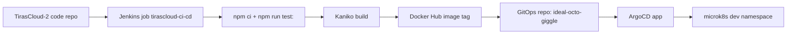

# CI/CD Pipeline для TirasCloud-2

Документ описує поточний шлях доставки сервісів TirasCloud-2 у dev microk8s через Jenkins, Docker Hub, GitOps і ArgoCD.

## Швидка схема



Простими словами: Jenkins бере код сервісу, перевіряє його тестом, збирає Docker image, пушить image у Docker Hub, міняє tag у GitOps repo, а ArgoCD застосовує цю зміну в Kubernetes.


## Запланована модернізація build

Поточний документ описує фактичний Jenkins + Kaniko flow. Наступний рекомендований build напрям зафіксований окремо в `BUILD_STRATEGY.md`.

Коротко: BuildKit/buildx розглядається як primary candidate для заміни Kaniko після POC. Причини: Dockerfile-compatible перехід, registry/PVC cache, Kubernetes/rootless builder path і майбутня готовність до SBOM, provenance та image signing.

Це ще не зміна поточного pipeline. До завершення POC Kaniko лишається задокументованою current implementation.

## Джерела правди

- Код сервісів: `C:\work\TirasCloud-2`.
- Pipeline: `C:\work\TirasCloud-2\Jenkinsfile`.
- Список test-команд: `C:\work\TirasCloud-2\package.json`.
- GitOps manifests: `C:\work\ideal-octo-giggle\cluster\apps\tirascloud`.
- ArgoCD Applications: `C:\work\ideal-octo-giggle\cluster\clusters\dev\apps`.
- Jenkins platform app: `C:\work\ideal-octo-giggle\cluster\clusters\dev\platform\jenkins.yaml`.
- Робочий чекліст: `CI_CD_INTEGRATION_CHECKLIST.md` поруч із цим документом.

## Як працює Jenkins

У `Jenkinsfile` є `serviceConfig`. Це allow-list: Jenkins збирає тільки сервіси, які там описані.

Для кожного сервісу entry містить:

- `imageName` - Docker Hub image, наприклад `tirascloud-logger`.
- `dockerfile` - шлях до Dockerfile від кореня app repo, наприклад `modules/logger/Dockerfile`.
- `testCommand` - команда, яка має пройти до build, наприклад `npm run test:logger`.
- `gitopsImageTagFile` - dev overlay, де Jenkins міняє `images[].newTag`.

Основні stages:

1. `Prepare` - читає `SERVICES`, прибирає дублікати, зупиняє build для невідомого сервісу, створює artifact tag `b${BUILD_NUMBER}-g${SHA12}`.
2. `Install Dependencies` - запускає `npm ci`.
3. `Test` - запускає `npm run test:<service>` для кожного вибраного сервісу.
4. `Docker Auth` - читає Jenkins credential `dockerhub-credentials` і готує Kaniko auth.
5. `Build And Push` - Kaniko збирає image з root context і пушить у Docker Hub.
6. `Update GitOps` - Jenkins clone-ить GitOps repo, міняє `newTag`, commit-ить і push-ить branch.

Artifact tag rule: Jenkins tag describes the built artifact, not the environment: `b<BUILD_NUMBER>-g<SHA12>`. For RocksDB/native services Jenkins appends `-rdb<RDB_SHA12>`, for example `b43-g91631719a2bc-rdbf47a0e91c742`. Dev/stage/prod identity stays in GitOps overlay, branch, or Argo CD Application; promotion must reuse the same `repo:tag` and verify the same digest instead of rebuilding the image.

Параметри Jenkins job:

```text
SERVICES=logger
DOCKER_NAMESPACE=<DOCKER_NAMESPACE>
GITOPS_REPO_URL=<GITOPS_REPO_SSH_URL>
GITOPS_BRANCH=ci-cd-tirascloud
```

Для одного сервісу в `SERVICES` вписуємо тільки його назву, наприклад `logger`. Кілька сервісів можна передати через кому, але безпечніше спочатку проганяти по одному.

## Поточний GitOps flow

GitOps repo описує бажаний стан Kubernetes. Jenkins не деплоїть напряму в кластер. Він тільки оновлює image tag у GitOps repo.

Для TirasCloud dev використовується така структура:

```text
cluster/apps/tirascloud/<service>/base
cluster/apps/tirascloud/<service>/overlays/dev
cluster/clusters/dev/apps/tirascloud-<service>.yaml
```

- `base` - спільний опис Deployment/Service без прив'язки до dev.
- `overlays/dev` - dev-налаштування: namespace, ConfigMap, PVC, image tag.
- `tirascloud-<service>.yaml` - ArgoCD Application, який каже ArgoCD, який path синхронізувати.

ArgoCD child Applications для сервісів живуть у `cluster/clusters/dev/apps/kustomization.yaml`. Там уже підключені `tirascloud-namespace`, `tirascloud-runtime-secrets`, `tirasmq`, `firestates`, `logger` та інші сервісні apps.

## Команди для перевірки

Локальна перевірка сервісу перед Jenkins:

```powershell
cd C:\work\TirasCloud-2
npm ci
npm run test:logger
```

Перевірка GitOps overlay:

```powershell
cd C:\work\ideal-octo-giggle
kubectl kustomize cluster/apps/tirascloud/logger/overlays/dev
```

Після Jenkins build перевірити, що змінився тільки image tag:

```powershell
cd C:\work\ideal-octo-giggle
git diff -- cluster/apps/tirascloud/logger/overlays/dev/kustomization.yaml
```

Перевірка ArgoCD app:

```powershell
kubectl -n argocd get app tirascloud-logger-dev
kubectl -n argocd get app tirascloud-logger-dev -o jsonpath="{.status.sync.status} {.status.health.status}"
```

Перевірка workload у Kubernetes:

```powershell
kubectl -n tirascloud-dev get deploy,pod,svc,pvc
kubectl -n tirascloud-dev logs deploy/logger -c logger --tail=100
kubectl -n tirascloud-dev logs deploy/logger -c filebeat --tail=100
```

Якщо використовується microk8s без окремого `kubectl`, заміни `kubectl` на `microk8s kubectl`.

## 100% перевірка image tag після pipeline

Цей ритуал використовуй після Jenkins build/push і ArgoCD sync для будь-якого сервісу в `TirasCloud-2` або `SCInfrastructure`. Назви namespace, ArgoCD Application, Deployment, container і image можуть відрізнятися, але логіка перевірки та сама.

100% підтвердження означає не тільки "GitOps файл має новий tag". Треба довести весь ланцюжок:

1. Jenkins зібрав і запушив очікуваний `image:tag`.
2. GitOps repo містить саме цей `newTag`.
3. ArgoCD бачить потрібний Git revision і має статус `Synced Healthy`.
4. Kubernetes Deployment template містить саме цей `image:tag`.
5. Поточний Running pod створений із цього template, а його container status показує той самий image.
6. Для повної гарантії digest у pod `imageID` збігається з digest цього tag у registry.

Приклад для `TirasCloud-2/logger`:

```powershell
$ns = "tirascloud-dev"
$service = "logger"
$app = "tirascloud-logger-dev"
$deploy = "logger"
$container = "logger"
$image = "docker.io/<DOCKER_NAMESPACE>/tirascloud-logger"
$tag = "b<BUILD_NUMBER>-g<SHA12>"
$expectedImage = "${image}:${tag}"
```

Для `SCInfrastructure` заміни ці змінні на відповідний namespace, ArgoCD Application, Deployment, container і registry image.

Спочатку перевір, що GitOps бажаний стан оновлений саме на tag із Jenkins run:

```powershell
cd C:\work\ideal-octo-giggle
git diff -- cluster/apps/tirascloud/logger/overlays/dev/kustomization.yaml
Select-String -Path cluster/apps/tirascloud/logger/overlays/dev/kustomization.yaml -Pattern "newTag: $tag"
```

Потім перевір ArgoCD. Результат має бути `Synced Healthy`; revision має відповідати GitOps commit, у якому Jenkins змінив tag:

```powershell
kubectl -n argocd get app $app
kubectl -n argocd get app $app -o jsonpath='{.status.sync.status} {.status.health.status} {.status.sync.revision}{"\n"}'
```

Після цього перевір Deployment template. У виводі для основного контейнера має бути рівно `$expectedImage`:

```powershell
kubectl -n $ns get deploy $deploy -o jsonpath='{range .spec.template.spec.containers[*]}{.name}{" "}{.image}{"\n"}{end}'
```

Дочекайся завершення rollout:

```powershell
kubectl -n $ns rollout status deploy/$deploy --timeout=180s
```

Візьми реальний selector із Deployment, підстав його у `$selector` і перевір усі поточні pods цього rollout:

```powershell
kubectl -n $ns describe deploy $deploy

$selector = "<selector-from-deployment>"
kubectl -n $ns get pods -l $selector -o wide
kubectl -n $ns get pods -l $selector -o jsonpath='{range .items[*]}{.metadata.name}{"\n"}{range .spec.containers[*]}{"  spec "}{.name}{" "}{.image}{"\n"}{end}{range .status.containerStatuses[*]}{"  status "}{.name}{" ready="}{.ready}{" restarts="}{.restartCount}{" image="}{.image}{" imageID="}{.imageID}{"\n"}{end}{end}'
```

Pass condition:

- основний container у кожному поточному Running pod має `spec <container> $expectedImage`;
- той самий container у `status` має `ready=True`;
- після завершення rollout не лишилося Running pods цього Deployment зі старим tag;
- `restartCount` не росте після rollout;
- `imageID` містить digest `sha256:...`.

Найсильніша перевірка - звірити digest. Якщо є Docker buildx:

```powershell
docker buildx imagetools inspect $expectedImage
```

Або, якщо використовується `crane`:

```powershell
crane digest $expectedImage
```

Digest із registry має збігатися з digest у `imageID` pod-а. Якщо tag збігається, але digest різний, це не проходить перевірку: tag міг бути перезаписаний або pod тягне інший immutable artifact.

Не вважай перевірку завершеною тільки за одним із сигналів:

- `git diff` показує `newTag`, але ArgoCD ще не синхронізувався;
- ArgoCD `Healthy`, але Deployment template ще зі старим image;
- Deployment template оновлений, але Running pod ще старий;
- Pod має потрібний tag у `spec`, але `imageID` не звірений із registry digest для mutable tags.

## Нотатка по logger

`logger` - сервіс, який пише локальні log-файли, тому в GitOps для нього є окремі правила:

- Deployment має `strategy.type: Recreate`, бо PVC `logger-logs` підключається як `ReadWriteOnce`.
- Основний контейнер пише в `/app/modules/logger/logs`.
- PVC `logger-logs` створюється в dev overlay і має `storageClassName: local-bulk`, `storage: 5Gi`.
- Sidecar `filebeat` читає ті самі файли через `/var/log/tirascloud/logger`.
- Filebeat відправляє logs у `logstash-ls-beats.elastic-stack.svc.cluster.local:5044`.
- HTTP healthcheck не доданий, бо сервіс не рекламує реальний HTTP health endpoint.

Для build у Jenkins:

```text
SERVICES=logger
```

## Як додати або перевірити сервіс

Перед додаванням сервісу в Jenkins allow-list мають існувати:

- `modules/<service>/Dockerfile`.
- `modules/<service>/package.json`.
- `modules/<service>/package-lock.json`.
- root script `test:<service>` у `package.json`.
- GitOps overlay path, який Jenkins зможе оновити через `gitopsImageTagFile`.
- ArgoCD Application у `cluster/clusters/dev/apps`.

Мінімальна перевірка:

```powershell
cd C:\work\TirasCloud-2
npm run test:<service>

cd C:\work\ideal-octo-giggle
kubectl kustomize cluster/apps/tirascloud/<service>/overlays/dev
```

Сервіс вважається готовим тільки після чотирьох підтверджень: Jenkins build/push успішний, ArgoCD status `Synced`, ArgoCD health `Healthy`, фактичний Running pod має очікуваний image tag або, для повної гарантії, очікуваний image digest.

## Простий словник

- CI - автоматична перевірка коду перед build. Тут це `npm ci` і `npm run test:<service>`.
- CD - доставка нової версії в середовище. Тут це оновлення GitOps tag і синхронізація ArgoCD.
- GitOps - підхід, де Git repo є описом бажаного стану Kubernetes.
- Overlay - dev-шар налаштувань поверх базового manifest.
- Image tag - artifact identifier for a Docker image, for example `b30-gabc12345def0`; RocksDB/native service tags add `-rdb<RDB_SHA12>`.
- Kaniko - інструмент, який збирає Docker image всередині Kubernetes без Docker daemon.
- ArgoCD - сервіс, який дивиться в GitOps repo і застосовує manifests у Kubernetes.
- PVC - запит на диск для pod. Для `logger` це місце, де лежать log-файли.
- Sidecar - другий контейнер у тому самому pod. Для `logger` це Filebeat.

## Відомі прогалини

- У GitOps `jenkins.yaml` seeded job default для `SERVICES` ще `tirasmq,firestates`, але актуальний `Jenkinsfile` у кодовому repo має ширший allow-list. У Jenkins UI опис параметра може оновитися тільки після перечитування job definition.
- Реальний ArgoCD health не підтверджується з локальних файлів. Його треба перевіряти командою `kubectl -n argocd get app ...` або в ArgoCD UI.
- Частина сервісів має тільки generic smoke test `scripts/ci-service-smoke.js`. Перед production promotion потрібні сервісні smoke або integration тести.
- RocksDB/native services мають окремий blocker: `auth`, `geo`, `ip2location`, `notifyjournal`, `storemod` використовують `modules/common/rdb.node`, а поточні `node:18-alpine` images не можна вважати runtime-ready без compatible runtime/rebuild, native CI smoke gate і PVC/writable path рішення. Деталі: `ROCKSDB_NATIVE_RUNTIME_BLOCKER.md`.
- Реальні secret values не повинні потрапляти в docs або GitOps. Документуємо тільки назви secret objects, key names і Jenkins credential IDs.

## Пов’язані канонічні документи

- `BUILD_STRATEGY.md` - напрям build technology і BuildKit POC criteria.
- `CI_CD_INTEGRATION_CHECKLIST.md` - rollout wave checklist.
- `ROCKSDB_NATIVE_RUNTIME_BLOCKER.md` - стислий native runtime blocker.
- `ROCKSDB_RUNTIME_SMOKE_RUNBOOK.md` - safe post-deploy validation для RocksDB services.
- `projects/shared/SoftwareSupplyChainSecurity.md` - shared SBOM, scanning, signing, provenance і LLM/agent safety baseline.

Поточний approved Kubernetes secret workflow для GitOps documentation: Sealed Secrets.
