# Карта залежностей TirasCloud-2

Дата аналізу: 2026-05-06

Документ описує runtime-залежності між сервісами TirasCloud-2 і залежності, які виходять за межі системи. Джерела: `C:\work\TirasCloud-2\package.json`, `config.json`, `modules/*/index.js`, `modules/*/Dockerfile`, IPC-код, `documentation/*` і наявні CI/CD нотатки в `C:\work\docs\projects\tirascloud-2`.

Позначення:

- `A -> B` означає, що `A` викликає, слухає, читає, пише або потребує `B` під час роботи.
- `soft/cyclic` означає, що залежність є реальною для повного сценарію, але сервіс може стартувати або деплоїтися до повної готовності другої сторони.
- У документі вказані тільки назви сервісів, каналів, портів і config/env keys. Значення секретів, токенів, паролів і приватних ключів свідомо не дублюються.

## 1. High-level runtime graph

```mermaid
flowchart TD
  Devices["Guard hardware devices<br/>UDP protocol"] --> GW["gateway<br/>UDP 4005"]
  Devices --> UDPNEW["udpnew workers<br/>UDP 4015/4016/4017"]
  FireDevices["Fire hardware devices<br/>UDP protocol"] --> FireGW["firegw<br/>UDP 4030"]
  FireDevices --> FireUDP["fireudp workers<br/>UDP 4033/4035/4037/4039/4041"]

  Mobile["Контроль NOVA / app clients<br/>Socket.IO"] --> APP["app_modded<br/>Socket.IO 5020/5022"]
  WebUsers["Public web users"] --> AUTH["auth<br/>HTTP 4081"]
  WebUsers --> V2WEB["v2web<br/>HTTP 4090"]
  SupportUsers["Support/admin users"] --> SUPPORT["support<br/>HTTP 4070"]
  SupportUsers --> TGBOT["tgsupportbot<br/>HTTP/WS 4044/4047"]

  GW --> TMQ["tirasmq<br/>TCP 4050"]
  UDPNEW --> TMQ
  FireGW --> TMQ
  FireUDP --> TMQ
  APP --> TMQ
  AUTH --> TMQ
  V2WEB --> TMQ
  SUPPORT --> TMQ
  TGBOT --> TMQ

  TMQ --> DEVICE["device / devstorage"]
  TMQ --> ONLINER["onliner"]
  TMQ --> JOURNAL["journal"]
  TMQ --> FIREJOURNAL["firejournal"]
  TMQ --> LOGGER["logger / log"]
  TMQ --> FIRESTATES["firestates"]
  TMQ --> MAILER["mailer"]
  TMQ --> NOTIFY["notifyjournal / nj"]
  TMQ --> FIRMWARE["firmware"]
  TMQ --> GEO["geo"]
  TMQ --> IP2["ip2location"]
  TMQ --> STOREMOD["storemod"]
  TMQ --> DEBUGGER["debugger"]
  TMQ --> ADDDEV["adddev"]
  TMQ --> SPAMER["spamer"]

  DEVICE --> Mongo["MongoDB"]
  GW --> Mongo
  FireGW --> Mongo
  APP --> Mongo
  AUTH --> Mongo
  SUPPORT --> Mongo
  TGBOT --> Mongo
  JOURNAL --> Mongo
  FIREJOURNAL --> Mongo
  FIRMWARE --> Mongo

  APP --> Redis["Redis"]
  ONLINER --> Redis
  SUPPORT --> Redis
  FireGW --> Redis

  AUTH --> RocksDB["RocksDB native stores"]
  GEO --> RocksDB
  IP2 --> RocksDB
  NOTIFY --> RocksDB
  STOREMOD --> RocksDB

  AUTH --> Firebase["Firebase Auth/Admin"]
  APP --> FCM["Firebase Cloud Messaging"]
  V2WEB --> Firebase
  MAILER --> Sendmail["local sendmail / SMTP path"]
  TGBOT --> Telegram["Telegram Bot API"]
  AUTH --> SMSC["SMSC.ua"]
  FireUDP --> Grafana["Grafana/Loki/Telegraf endpoint"]
  FireGW --> Grafana
  FIRMWARE --> FirmwareHost["firmware download host"]
```



## 2. Shared platform dependencies

| Dependency | Used by | Призначення | Config/env keys |
| --- | --- | --- | --- |
| `tirasmq` | Майже всі deployable modules | Центральний TCP IPC broker. Сервіси реєструються під іменем каналу і обмінюються JSON payload/report messages. | `TMQ_HOST`, `TMQ_PORT`, `TMQ_PASSWORD`, `config.tmq.*` |
| `modules/common` | Більшість backend-сервісів | Спільні моделі MongoDB, Redis wrapper, logger/debug helper, errors, time utils, TMQ clients, OLog client. | Залежить від `config.json` і env override keys окремих drivers |
| MongoDB | `device`, `gateway`, `firegw`, `auth`, `app_modded`, `support`, `tgsupportbot`, `journal`, `firejournal`, `firmware`, `mailer`, `spamer`, `geo`, `storemod` | Основна persistence база: users, devices, configs, journals, firmware, support tickets/messages. | `MONGO_URL`, `config.mongo.url`, `config.mongo.options` |
| Redis | `app_modded`, `support`, `gateway` legacy path, `firegw`, `spamer`, shared `common/redis` users | Runtime cache, key/value state, selected notify/keyspace workflows, support/session data. | `REDIS_HOST`, `REDIS_PORT`, `REDIS_PASSWORD` або `REDIS_PASSWD`, `config.redis.*` |
| RocksDB native addon | `auth`, `geo`, `ip2location`, `notifyjournal`, `storemod` | Local native storage through `modules/common/rdb.node`; separate runtime blocker for container compatibility. | Service-local storage paths, `common/rdbDriver.js` |
| JWT secret | `auth`, `app_modded`, `support`, `tgsupportbot`, `debugger`, `v2web` | Токени для користувацьких і support/admin сценаріїв. | `JWT_SECRET`, `config.auth.jwtsecret`, service-local `config.jwt` |

## 3. Таблиця service-to-service dependencies

| Service | IPC channel / public surface | Depends on | Чому |
| --- | --- | --- | --- |
| `tirasmq` | TCP `4050` | none | Root broker для TMQ clients і message channels. |
| `logger` | `log` | `tirasmq` | Receives log payloads з gateway/debug flows і writes through `loggerFunctions`. |
| `journal` | `journal` | `tirasmq`, MongoDB | Stores і reads guard device events, notifications і device timezone updates. |
| `firejournal` | `fire-journal` | `tirasmq`, MongoDB | Fire-device analogue of `journal`; receives fire event journal requests. |
| `mailer` | `mailer` | `tirasmq`, MongoDB, local sendmail path | Sends emails requested by `auth`, `device`, `spamer`; writes mail send logs to MongoDB. |
| `firmware` | `firmware`, HTTP firmware API | `tirasmq`, MongoDB, firmware file host | Provides firmware metadata і download links; used by `device`/support/admin flows. |
| `device` | `devstorage`, health HTTP | `tirasmq`, MongoDB, Redis/common, `gateway`, `firegw`, `onliner`, `mailer`, `auth` | Owns device records, configs, rights і settings. Updates downstream gateways/onliner і sends user invitation email/auth flows. `gateway`/`firegw` є `soft/cyclic` під час rollout. |
| `gateway` | `gw`, UDP `4005`, health HTTP | `tirasmq`, MongoDB, `logger`, `journal`, `onliner`, `device`, `udpnew` | Guard UDP gateway. Loads device keys from MongoDB, routes device packets/events, asks `devstorage` to add old/new devices, redirects commands/config/log exchange to UDP workers. |
| `udpnew` | worker aliases such as `udpnew1_kx`, UDP `4015/4016/4017`, health HTTP | `tirasmq`, `gateway`, `onliner`, `device`, `storemod`, `geo`, `debugger` | Guard UDP workers. Request keys from `gw`, report online state to `setonline`, write configs to `storemod`, update configs/software in `devstorage`, update geo and WRL debugger channels. |
| `onliner` | `onliner`; listens `send`, `getonline`, `setonline`, `adminconfig`, `loaderconfig`, `configfile`, `downloadlog`, `fire-*` | `tirasmq`, MongoDB via common models, local `online_*.bkp` state, `udpnew`, `fireudp`, `debugger` | Tracks device online/server state and redirects commands to correct UDP worker based on last known device server. No active Redis client path is wired in current code; `debugger` is a soft integration. |
| `debugger` | `debugger`, `wrldbg`, HTTPS/WS debug surface | `tirasmq`, `onliner`, `udpnew` | Diagnostic UI and WRL debug channel; sends commands through `send` and receives WRL debug messages. |
| `geo` | `geo` | `tirasmq`, MongoDB, RocksDB | Updates and resolves GSM/cell geolocation data from UDP events. |
| `ip2location` | `ip2location` | `tirasmq`, RocksDB | Resolves IP location for app/support flows through IPC action `find`. |
| `storemod` | `storemod` | `tirasmq`, MongoDB, RocksDB | Stores module/config exchange data from `udpnew`. |
| `firegw` | `fire-gw`, UDP `4030`, health HTTP | `tirasmq`, MongoDB, Redis, `onliner`, `fireudp`, `device`, `firestates` | Fire gateway. Loads fire device keys, assigns fire UDP servers, propagates ban/Grafana-log state, sends online/server updates. |
| `fireudp` | worker aliases such as `fireudp1_dev`, UDP `4033/4035/4037/4039/4041`, health HTTP | `tirasmq`, MongoDB/common, `firegw`, `onliner`, `device`, `firestates`, `firejournal` | Fire UDP workers. Request keys from `fire-gw`, report online to `fire-setonline`, update fire configs/software in `devstorage`, publish fire events/states. |
| `firestates` | `fire-states` | `tirasmq` | Maintains/query fire state snapshots. Current active path не relies on RocksDB, despite a storage file existing. |
| `auth` | `auth`, HTTP `4081` | `tirasmq`, MongoDB, Redis/cache, Firebase Admin/Auth, `mailer`, `app_modded` soft/cyclic, RocksDB | Handles login, Firebase token verification, Tiras JWT issuance, registration/confirmation, user deletion and session banning. Sends email through `mailer`; can notify `app` to sync user state. |
| `auth_mock` | `auth`, HTTP `4081` | `tirasmq` | Test/mock replacement for `auth`; not a normal deployable service in the rollout checklist. |
| `app_modded` | `app`, Socket.IO `5020/5022`, internal `fcmsend` | `tirasmq`, MongoDB, Redis, `device`, `onliner`, `auth`, `gateway`, `journal`, `notifyjournal`, `ip2location`, FCM | Main app backend for Контроль NOVA clients. Authenticates sockets, manages gadgets, commands/config/file exchange, listens `events`/`states`, sends push notifications. Strongly cyclic with core services. |
| `v2web` | `v2`, HTTP `4090` | `tirasmq`, Firebase web SDK/Auth, `auth`/`device` via proxied IPC flows | Public web/auth frontend server and static bundle. Handles user management links and forwards selected actions over TMQ. |
| `support` | `support-react`, HTTP `4070`, Vite/dev `5173` | `tirasmq`, MongoDB, Redis, `gateway`, `firegw`, `onliner`, `storemod`, `geo`, `app_modded`, `spamer`, `device` | Support/admin React + Express surface. Searches users/devices, sends commands, manages firmware/config/log exchange, notifications, reports, tickets and system tools. |
| `adddev` | `adddev`, HTTP `4085` | `tirasmq`, `device`/`devstorage` | Thin HTTP service for adding/updating devices through `devstorage`. |
| `notifyjournal` | `nj` | `tirasmq`, RocksDB | Stores per-user notification journal, unread counters and server/console notification settings. |
| `spamer` | `spamer` | `tirasmq`, MongoDB/Redis, `mailer` | Mailing/bulk notification helper that delegates email send to `mailer`. |
| `tgsupportbot` | `tgbot`, HTTP `4044`, WS `4047` | `tirasmq`, MongoDB, Telegram Bot API, JWT/Auth data | Telegram support bot and operator WebSocket bridge. Counts dialogs/messages over IPC and stores support conversations in MongoDB. |
| `emulator` | local process only | MongoDB, UDP protocol implementation | Development/test device emulator; not part of normal service rollout. |
| `common` | library only | MongoDB, Redis, RocksDB, TMQ client, Grafana helper | Shared code, not a separately deployed runtime service. |

## 4. Main runtime flows

### Guard device path

1. `gateway` listens for old/primary UDP packets on `4005`, loads guard device keys from MongoDB and sends logs/events through TMQ.
2. `udpnew` spawns workers from `modules/udpnew/settings.json`; each worker registers by alias, binds its UDP port and requests keys from `gw`.
3. Device packets in `udpnew` become TMQ messages to `events`, `states`, `devstorage`, `geo`, `storemod`, `setonline` and `wrldbg`.
4. `onliner` tracks device online state and redirects app/support commands from `send`, `adminconfig`, `loaderconfig`, `configfile`, `downloadlog` to the correct worker.
5. `device` persists config/settings/rights and can tell `gateway` to reload a device or update settings.

Важливі cyclic edges:

- `gateway <-> device`: gateway can auto-add/load devices; device can ask gateway to reload keys/settings.
- `gateway/udpnew <-> onliner`: UDP side reports online/server state; onliner routes commands back.
- `udpnew -> app_modded` is soft through event/state processing rather than a strict startup dependency.

### Fire device path

1. `firegw` listens on UDP `4030`, loads fire device data and manages fire UDP server assignment.
2. `fireudp` workers bind ports from `modules/fireudp/settings.json`, request keys from `fire-gw`, parse fire packets and send fire online/events/states/config updates.
3. `onliner` listens to `fire-send`, `fire-setonline`, `fire-getonline` and `fire-adminconfig` to route fire commands.
4. `firestates` answers state requests on `fire-states`; `firejournal` stores fire journal records.
5. Fire Grafana logging state is kept by `firegw` and propagated to `fireudp` workers when enabled.

### App, public web and support path

1. `auth` exposes HTTP auth/registration/confirmation endpoints and validates Firebase ID tokens before issuing Tiras JWTs.
2. `app_modded` exposes Socket.IO for mobile app clients. It uses JWT validation, loads device/user state from MongoDB/Redis and talks to `devstorage`, `onliner`, `gw`, `journal`, `nj`, `auth`, `events`, `send`.
3. `v2web` serves the public V2 web bundle and user-management link handlers, with Firebase web SDK on the frontend.
4. `support` exposes admin/support UI and route handlers that call TMQ channels for device search, commands, config exchange, firmware, notifications and reports.
5. `tgsupportbot` bridges Telegram users and support operators through Telegram polling plus local HTTP/WS surfaces.

## 5. External dependencies

| Service/module | External dependency | Config/env keys | Призначення |
| --- | --- | --- | --- |
| `auth` | Firebase Admin/Auth | `modules/auth/firebasesdkkey.json`, Firebase SDK config files | Verifies Firebase ID tokens, reads/updates/deletes Firebase users. |
| `v2web` | Firebase web SDK | frontend Firebase config object | Public web authentication flows. |
| `app_modded` | Firebase Cloud Messaging | service account JSON paths, `webapp.fcmapikey`, FCM service classes | Push notifications to mobile clients. |
| `mailer` | Local sendmail / SMTP path | sendmail executable path in code, mail payload from IPC | Email delivery for auth, invitations, mailing and service notifications. |
| `common/smsc.js`, `auth` notification flows | SMSC.ua | SMSC login/password are code/config concerns, not documented here | SMS and phone-call confirmation for registration/phone activation flows. |
| `tgsupportbot` | Telegram Bot API | `TGBOT_TG_TOKEN`, service-local Telegram config key | Polling Telegram messages and sending support replies/files. |
| `common/timezone.js` | TimeZoneDB API | TimeZoneDB API key in code/config | Варіантal refresh of timezone offset list. |
| `firegw`, `fireudp`, `common/grafanaLogger.js` | Grafana/Loki/Telegraf-compatible HTTP endpoint | `GRAFANA_HOSTNAME`, `GRAFANA_PORT`, `GRAFANA_PATH`, `GRAFANA_CERT_PATH`, `config.grafana.*` | Sends selected fire-device diagnostics and packet errors to external log backend. |
| `firmware`, `device` | Firmware download host | `LINK_BASE_URL`, `DEVSTORAGE_FWLINK_BASE_URL`, `FIRMWARE_PORT`, service-local firmware config keys | Builds firmware metadata/download URLs and serves firmware downloads. |
| `gateway`, `udpnew`, `firegw`, `fireudp` | Physical Tiras devices over UDP | UDP ports and device keys in MongoDB | Main device communication channel. |
| `support`, `app_modded`, `debugger`, `tgsupportbot` | Browser/mobile/WebSocket clients | HTTP/Socket.IO/WS ports, JWT secret/certs keys | User-facing realtime/API surfaces. |
| Docker/Kubernetes runtime | Container registry, Kubernetes secrets/config maps | Keys listed in `KUBERNETES_SECRETS.md` | Injects service runtime config and secrets in cluster. |

## 6. Ports and protocols

| Service | Protocol/surface | Port(s) | Нотатки |
| --- | --- | --- | --- |
| `tirasmq` | TCP TMQ broker | `4050` | Root IPC transport. |
| `gateway` | UDP device gateway, HTTP health | UDP `4005`, health `7005` | Dockerfile exposes `7005` and `4005/udp`. |
| `udpnew` | UDP workers, HTTP health | UDP `4015/4016/4017`, health `7015/7016/7017` | Worker health is `port + 3000`. |
| `firegw` | UDP fire gateway, HTTP health | UDP `4030`, health on same exposed service port | Dockerfile exposes `4030/udp`; health check calls HTTP on `4030`. |
| `fireudp` | UDP fire workers, HTTP health | UDP `4033/4035/4037/4039/4041`, health `4033` | Worker aliases are configured in `modules/fireudp/settings.json`. |
| `device` | TMQ + HTTP health | `7010` | `DEVSTORAGE_HEALTH_PORT` override. |
| `onliner` | TMQ + HTTP health | `7001` or `ONLINER_HEALTH_PORT` | Routes command channels; no public business HTTP API. |
| `app_modded` | Socket.IO v2/v4 + health | `5020`, `5022` | `PORT` can override v4 server. |
| `auth` | HTTP API + health | `4081` | Routes include login, token, registration, confirmation, fireauth, health. |
| `adddev` | HTTP API + health | `4085` | Thin device-add API. |
| `v2web` | HTTP static/API | `4090` runtime, Dockerfile exposes `4080/4081` | There is a code/Dockerfile port mismatch to keep in mind during deploy. |
| `support` | HTTP static/API, dev Vite | `4070`, `5173` | Dockerfile exposes both. |
| `tgsupportbot` | HTTP + WebSocket | `4044`, `4047` | Also uses Telegram polling outbound. Docker health check references `4105`, which should be verified. |
| `firmware` | HTTP firmware API | service config `port`, default Docker health `4094` | Service-local `config.json` has its own port setting; deployment may override with `FIRMWARE_PORT`. |
| `debugger` | HTTPS/WS debug UI | `9000`, legacy/debug WS `4021` | Dockerfile exposes `9000`; code also creates a secure debug WS server. |
| `journal`, `firejournal`, `geo`, `ip2location`, `spamer`, `storemod`, `notifyjournal` | TMQ + optional health in Docker | `4060`, `4091`, `4096`, `4097`, `4102`, `4103`, `4099` | These are mostly worker-style services with health endpoints in container checks. |

## 7. Межі configuration і secret

Не копіювати runtime secret values у docs. Корисні dependency-level keys:

- TMQ: `TMQ_HOST`, `TMQ_PORT`, `TMQ_PASSWORD`, `config.tmq.host`, `config.tmq.port`, `config.tmq.password`.
- MongoDB: `MONGO_URL`, `config.mongo.url`, `config.mongo.options`.
- Redis: `REDIS_HOST`, `REDIS_PORT`, `REDIS_PASSWORD`, `REDIS_PASSWD`, `config.redis.host`, `config.redis.port`, `config.redis.passwd`.
- JWT/Auth: `JWT_SECRET`, `config.auth.jwtsecret`, service-local JWT config keys.
- Health/ports: `DEVSTORAGE_HEALTH_PORT`, `GATEWAY_HEALTH_PORT`, `ONLINER_HEALTH_PORT`, `FIRMWARE_PORT`, `PORT`.
- Firmware links: `LINK_BASE_URL`, `DEVSTORAGE_FWLINK_BASE_URL`.
- Notifications and support: `NOTIFY_TTL`, `SUPPORT_HTTP_KEY`, `SUPPORT_HTTP_CERT`, `TGBOT_HTTP_KEY`, `TGBOT_HTTP_CERT`, `TGBOT_HTTP_PORT`, `TGBOT_TG_TOKEN`, `TGBOT_WS_PORT`, `TGBOT_WS_KEY`, `TGBOT_WS_CERT`.
- Grafana/log shipping: `GRAFANA_HOSTNAME`, `GRAFANA_PORT`, `GRAFANA_PATH`, `GRAFANA_CERT_PATH`.

## 8. Practical rollout notes

- `tirasmq`, MongoDB і Redis є platform prerequisites перед тим, як більшість services стануть useful.
- `common` є shared code dependency, а не deployable service.
- `auth_mock` і `emulator` є non-production support modules.
- RocksDB-affected services мають лишатися за native runtime gate, documented у `ROCKSDB_NATIVE_RUNTIME_BLOCKER.md`: `auth`, `geo`, `ip2location`, `notifyjournal`, `storemod`.
- Cyclic core group треба treated as integration-tested, а не strictly topologically sorted: `gateway`, `device`, `onliner`, `udpnew`, `firegw`, `fireudp`, `app_modded`, `support`.
- Для maintenance перевіряти обидві сторони TMQ channel. Example: `support -> send` ultimately depends on `onliner` listening to `send`, а потім on active UDP worker owning the target device.

---

## 9. Redis Keys

### К-сть ключів на dev-середовищі (в поточному стані)

```
  65376 states
   1463 tokens
    703 fcmtokens
    697 sessions
    485 attempts
    244 uids
    181 tokens_
     58 sskatch
     42 uids_
     17 fcmdevices
      3 token
      2 uid
      1 uit
      1 semiofflines
      1 onlines
      1 onliner
      1 grafana_fire_devices
```

### Для чого використовується кожен з ключів та яким є його вплив на UX користувача та роботу функціоналу

| Ключ                   | Призначення                            | Вплив на UX користувача (якщо буде втрачено) | Вплив на роботу функціоналу (якщо буде втрачено) |
| ---------------------- | -------------------------------------- | -------------------------------------------- | ------------------------------------------------ |
| `states`               | стани приладів (?)                     |                                              |                                                  |
| `tokens`               | (?)                                    |                                              |                                                  |
| `fcmtokens`            | (?)                                    |                                              |                                                  |
| `sessions`             | сесії                                  |                                              |                                                  |
| `attempts`             | лічильники спроб / антиаб’юз           |                                              |                                                  |
| `uids`                 | (?)                                    |                                              |                                                  |
| `tokens_`              | токени (?)                             |                                              |                                                  |
| `sskatch`              | ?                                      |                                              |                                                  |
| `uids_`                | (?)                                    |                                              |                                                  |
| `fcmdevices`           | (?)                                    |                                              |                                                  |
| `token`                | токен від Firebase для авторизації (?) |                                              |                                                  |
| `uid`                  | id приладу (?)                         |                                              |                                                  |
| `uit`                  | (?)                                    |                                              |                                                  |
| `semiofflines`         | (?)                                    |                                              |                                                  |
| `onlines`              | (?)                                    |                                              |                                                  |
| `onliner`              | (?)                                    |                                              |                                                  |
| `grafana_fire_devices` |                                        |                                              |                                                  |

