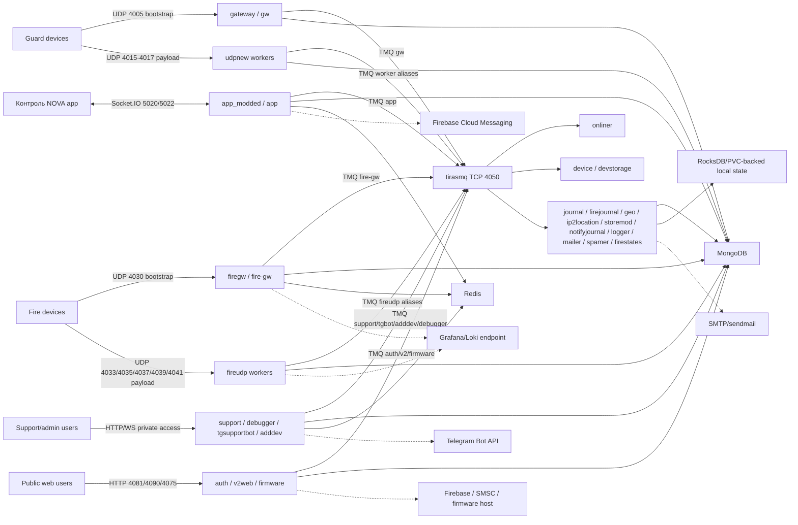
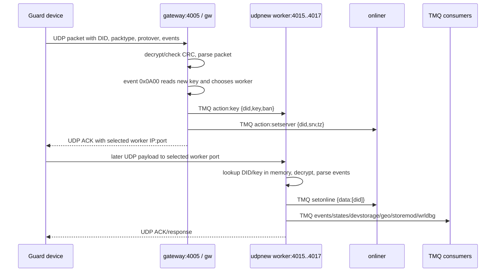
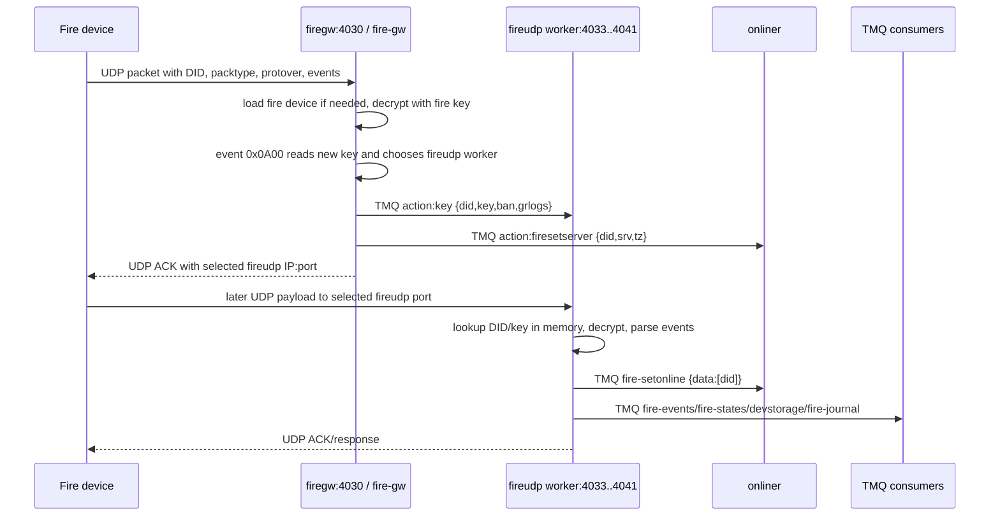

# Карта traffic routing сервісів TirasCloud-2

Дата оновлення: 2026-06-09  
Репозиторій коду: `C:\work\TirasCloud-2`  
GitOps target: `C:\work\ideal-octo-giggle`  
FigJam: [TirasCloud-2 Service Traffic Map](https://www.figma.com/board/CV2x17NzEickbvgRwvDeHY?utm_source=codex&utm_content=edit_in_figjam&oai_id=&request_id=47bc20b3-b709-4a6d-ac53-5960084ba6b9&architecture=true)

## Межі документа

Цей документ є єдиною картою runtime traffic routing для майбутньої міграції TirasCloud-2 з AWS Instance без Kubernetes на Kubernetes cluster з GitOps. Він об'єднує:

- device-facing UDP bootstrap і payload routing;
- HTTP/HTTPS/WebSocket ingress для app/public/support/admin flows;
- internal service-to-service routing через `tirasmq`;
- stateful dependencies і PVC-sensitive paths;
- external API/service dependencies;
- GitOps exposure boundary для Dev і future Stage/Prod.

Документ не є маніфестом Kubernetes і не дублює secret values. Для секретів тут вказані тільки names, key names або env var names. Реальні IP/credentials не копіюються; edge endpoints позначені placeholders, якщо не потрібні для коду як факт.

## Короткий висновок

TirasCloud-2 має три різні traffic planes, які не можна змішувати під час Kubernetes migration:

| Plane | Основний routing key | Kubernetes shape | Що критично не переплутати |
| --- | --- | --- | --- |
| Device UDP | external `IP:port`, DID у payload, device key, worker alias | L4 `NodePort` зараз або `LoadBalancer`/MetalLB пізніше | UDP не має HTTP `Host`/`Path`; Ingress/Gateway HTTP не маршрутизує ці пакети. |
| User/admin HTTP/WS | DNS hostname, path, WebSocket upgrade | `Ingress` або Gateway API `HTTPRoute` -> `ClusterIP` | Публічний доступ і VPN/private access мають бути окремими policy decisions. |
| Internal TMQ | TMQ channel / alias | `tirasmq` `ClusterIP` TCP `4050` | TMQ alias є runtime identity; для UDP workers не можна безпечно запускати duplicate aliases behind one selector. |

Найбільш migration-sensitive частина - UDP. `gateway` і `firegw` не є reverse-proxy. Вони виконують bootstrap/key/server-assignment: після event `0x0A00` gateway вибирає worker, відправляє йому key через TMQ і повертає device зовнішній worker `IP:port`. Після цього нормальний payload іде напряму на `udpnew` або `fireudp` worker port.

## Traffic classes і boundary

| Traffic class | From | Through | To | GitOps/Kubernetes нотатки |
| --- | --- | --- | --- | --- |
| Guard UDP bootstrap | Guard device | `<EDGE_IP>:4005/UDP` -> MikroTik/NAT або LB -> `gateway-device-nodeport` / future LB | `gateway` UDP `4005`, TMQ alias `gw` | Dev NodePort target: service port `4005`, nodePort `30005`, `externalTrafficPolicy: Local`. |
| Guard UDP payload | Guard device | `<EDGE_IP>:4015-4017/UDP` -> L4 exposure | `udpnew1_kx`..`udpnew3_kx` UDP `4015-4017` | Device gets worker `IP:port` from `gateway/settings.json` ACK after `0x0A00`. |
| Fire UDP bootstrap | Fire device | `<EDGE_IP>:4030/UDP` -> L4 exposure | `firegw` UDP `4030`, TMQ alias `fire-gw` | Dev NodePort target: service port `4030`, nodePort `30030`, `externalTrafficPolicy: Local`. |
| Fire UDP payload | Fire device | `<EDGE_IP>:4033/4035/4037/4039/4041/UDP` -> L4 exposure | `fireudp1_dev`..`fireudp5_dev` | Device gets worker `IP:port` from `firegw/serverList.json` ACK after `0x0A00`. |
| Mobile app realtime | Контроль NOVA app | HTTP/WS edge | `app_modded` Socket.IO `5020`, `5022` | GitOps has `app-modded` ClusterIP; Gateway API proposal has separate legacy/v4 hostnames. |
| Public auth/web/firmware | Web users / app links | HTTP edge | `auth`, `v2web`, `firmware` | GitOps Gateway API layer is proposal-only until controller/GatewayClass/hostnames are confirmed. |
| Support/admin | Support users, operators | VPN/private HTTP edge | `support`, `debugger`, `tgsupportbot`, `adddev` | Should remain private by default; current private ingress docs cover platform UIs, app HTTPRoute layer remains proposal. |
| Internal TMQ | Services | `tirasmq:4050` | TMQ aliases/channels | Private `ClusterIP`; no public exposure. |
| Stateful data | Services | service env/config | MongoDB, Redis, RocksDB/PVC, local files | PVC and restart behavior are per-service migration risks. |
| External APIs | Services | outbound network | Firebase, FCM, Telegram, SMTP/sendmail, SMSC.ua, Grafana/Loki, firmware host | Need egress, secrets, certificates and retry behavior checked per service. |

## High-level runtime graph



## Service surfaces

### Device-facing UDP core

| Service | Runtime identity | Inbound ports | Main outbound / TMQ traffic | State | Migration notes |
| --- | --- | --- | --- | --- | --- |
| `gateway` | TMQ alias `gw` | UDP `4005`, health TCP `7005` | `key` to `udpnew*`, `setserver` to `onliner`, `events`, `journal`, `log`, `devstorage` | Mongo `device`, `devconf`, in-memory device/key state | `gateway/settings.json` must advertise external worker `IP:port`, not Pod IP/ClusterIP/loopback. |
| `udpnew` | `udpnew1_kx`, `udpnew2_kx`, `udpnew3_kx` | UDP `4015`, `4016`, `4017`; health TCP `7015-7017` | `setonline`, `events`, `states`, `devstorage`, `geo`, `storemod`, `wrldbg`; consumes `send`, `adminconfig`, `loaderconfig`, `configfile`, `downloadlog`, `getdevinfo` via redirects | In-memory keys, `dev.socket`, command queues; Mongo config/journal/files | Do not horizontally scale duplicate worker aliases without redesigning identity/state model. |
| `firegw` | TMQ alias `fire-gw` | UDP `4030` | `key` to `fireudp*`, `firesetserver` to `onliner`, `fire-events`, `fire-states`, `devstorage` | Mongo `firedevice`, `fireconf`; Redis `grafana_fire_devices`; in-memory fire device state | `firegw/serverList.json` controls advertised external fire worker endpoints. |
| `fireudp` | `fireudp1_dev`..`fireudp5_dev` | UDP `4033`, `4035`, `4037`, `4039`, `4041` | `fire-setonline`, `fire-events`, `fire-states`, `devstorage`, `fire-journal`; consumes `send`, `adminconfig`, config/log flows | In-memory keys, `dev.socket`, command queues; Mongo fire config/journal/files | Same duplicate-alias risk as `udpnew`; outbound commands need last-seen device socket. |
| `onliner` | TMQ alias `onliner`; listeners for command and online channels | health TCP `7001`; no public business HTTP API | Receives `send`, `fire-send`, `setonline`, `fire-setonline`, `getonline`, `fire-getonline`, `adminconfig`, `fire-adminconfig`, `loaderconfig`, `configfile`, `downloadlog`; redirects to saved worker alias | In-memory `did -> srv`, backup files `online_GUARD.bkp`, `online_FIRE.bkp` | Without PVC, cold restart loses backup state; system recovers after device packets, but immediate commands can fail. |

### HTTP/WS entrypoints

| Service | Runtime identity | Inbound surface in code/GitOps | Main TMQ dependencies | External dependencies | Migration notes |
| --- | --- | --- | --- | --- | --- |
| `app_modded` | TMQ alias `app`; internal `fcmsend` path | Socket.IO `5020`, Socket.IO v4 `5022`; GitOps service `app-modded` | Consumes `events`, `states`; sends `send`, `getonline`, `devstorage`, `journal`, `nj`, `auth`, `ip2location` | FCM, MongoDB, Redis | WebSocket routing must preserve upgrade behavior; legacy/v4 split is proposed as separate hosts. |
| `auth` | TMQ alias `auth` | HTTP `4081` | `mailer`, `app`, `devstorage` related auth/user flows | Firebase Admin/Auth, SMSC.ua, MongoDB, RocksDB ban/session metadata | Public/private exposure policy must be decided before promoting HTTPRoute. |
| `v2web` | TMQ alias `v2` | HTTP `4090` | Proxies selected actions to `auth`/`devstorage` over TMQ | Firebase web SDK | GitOps service uses `4090`; older Docker/code references should stay under port mismatch watch. |
| `support` | TMQ alias `support-react` | HTTP `4070`; dev Vite `5173` exists but runtime service is `4070` | Sends `send`, `fire-send`, `getonline`, `devstorage`, `gw`, `fire-gw`, `storemod`, `geo`, `spamer`, `events` | MongoDB, Redis, optional OLog/WebSocket support paths | Should be VPN/private by default; PM2/system tools routes need strict runtime flags. |
| `tgsupportbot` | TMQ alias `tgbot` | HTTP `4044`, WS `4047` | Support dialog/message IPC | Telegram Bot API, MongoDB | Telegram webhook vs polling and public exposure must be confirmed. |
| `debugger` | TMQ alias `debugger`; WRL alias `wrldbg` | WSS `4021`; Docker/GitOps expose debugger service | `send`, `wrldbg`, `onliner` debug flows | certificates / WSS clients | Keep private; code has default TMQ host fallback that should be environment-audited. |
| `firmware` | TMQ alias `firmware` | HTTP `4075` in GitOps | Firmware metadata requests, device/support firmware flows | firmware download host, MongoDB | `LINK_BASE_URL` / `FIRMWARE_PORT` must match the chosen ingress model. |
| `adddev` | TMQ alias `adddev` | HTTP `4085` | `devstorage` add/update calls | none direct found beyond TMQ | Public exposure should be explicit, not default. |

### Private TMQ-only services

| Service | TMQ identity / channel | Main role | Stateful dependency | Kubernetes service? |
| --- | --- | --- | --- | --- |
| `tirasmq` | TCP broker `4050` | Central IPC transport for JSON request/response/redirect flows | memory/runtime only | Yes, `ClusterIP` TCP `4050`. |
| `device` | `devstorage` | Device records, configs, rights, firmware/config/log metadata | MongoDB | Yes, health TCP `7010`; no public business HTTP route. |
| `journal` | `journal` | Guard event/journal storage and reads | MongoDB | No public Service needed unless health is exposed by manifest. |
| `firejournal` | `fire-journal` | Fire event/journal storage and reads | MongoDB | No public Service. |
| `logger` | `log` | Receives log payloads | local/log output path depending runtime | No public Service. |
| `mailer` | `mailer` | Email delivery requested by auth/device/spamer | MongoDB log collection, SMTP/sendmail | No public Service. |
| `geo` | `geo` | GSM/cell geolocation lookup and `devconf.info.geo` update | RocksDB `geo/gsmStorage`, MongoDB | No public Service; PVC needed for RocksDB. |
| `ip2location` | `ip2location` | IP ASN/Geo lookup | RocksDB `ip2location/ipStorage` | No public Service; PVC needed for RocksDB. |
| `storemod` | `storemod` | Module serial index from configs | RocksDB `storemod/modulesStorage`, MongoDB | No public Service; PVC needed for RocksDB. |
| `notifyjournal` | `nj` | Notification journal/unread counters | RocksDB `notifyjournal/notifyStorage` | No public Service; PVC needed for RocksDB. |
| `spamer` | `spamer` | Mailing/bulk notification helper | `localRedis` JSON file queue, MongoDB, `mailer` | No public Service; file path persistence decision needed. |
| `firestates` | `fire-states` | Fire state snapshots in memory | RocksDB wrapper exists, active code uses memory | No public Service; persistence behavior is an open gap. |

## Device UDP deep dive

### UDP has no Host/Path

UDP packets reaching Node.js `dgram` sockets contain source IP/port, destination IP/port and payload bytes. They do not contain HTTP `Host` or URL path. If a device is configured with a domain, DNS resolution happens before the UDP datagram is sent. The server only sees packet metadata and payload, not the domain name.

Device UDP routing is therefore driven by:

- external `IP:port` that received the packet;
- DID inside the payload;
- device key and runtime state in gateway/worker memory;
- worker TMQ alias selected by `gateway`/`firegw` and stored by `onliner`;
- last-seen `dev.socket = { ip, port }` on the worker.

### Guard flow: `gateway` to `udpnew`



Implementation points:

- `modules/gateway/index.js` binds UDP `4005`, TMQ alias comes from `modules/gateway/settings.json` as `gw`.
- `modules/gateway/events.js` handles event `0x0A00`, reads a new device key, picks `udpnew1_kx`/`udpnew2_kx`/`udpnew3_kx`, sends `action: "key"` to the worker and `action: "setserver"` to `onliner`.
- `modules/udpnew/index.js` starts one worker process per entry from `modules/udpnew/settings.json`.
- Each `udpnew` worker registers its own TMQ alias, binds its UDP port, asks `gw` for keys through `action: "getdevkeys"`, and stores `dev.socket` from the latest inbound packet.
- Unknown DID packets are dropped as `unknownDevice`; the worker does not fetch a key from `gw` for every unknown packet.

### Fire flow: `firegw` to `fireudp`



Implementation points:

- `modules/firegw/gateway.js` binds UDP `4030`.
- `modules/firegw/events/protoV3.js` handles event `0x0A00`, uses `serverManger.js` and `serverList.json`, sends `action: "key"` to `fireudpN_dev` and `action: "firesetserver"` to `onliner`.
- `modules/fireudp/index.js` starts one worker process per `modules/fireudp/settings.json` entry.
- `modules/fireudp/udpServer.js` requests keys from `fire-gw` with `action: "getdevkeys", alias: settings.alias`.
- Fire diagnostics can be propagated to Grafana/Loki-compatible endpoint for selected devices through `grafana_fire_devices`.

### Binding contract

Runtime has two different bindings:

| Binding | Used for | Meaning |
| --- | --- | --- |
| `server.alias` / `server.name` | TMQ routing | Internal worker identity such as `udpnew1_kx` or `fireudp1_dev`. |
| `server.ip` / `server.port` | UDP ACK to device | External edge endpoint that device will use after bootstrap. |

For Kubernetes, the advertised `server.ip/server.port` must be the external edge IPv4/VIP/NAT endpoint that devices can reach. It must not be `127.0.0.1`, Pod IP or ClusterIP. Current code writes IPv4 bytes into the ACK payload, so DNS names are not a safe replacement without code/protocol changes.

## Downstream command paths

Guard command path:

```text
app_modded / support / device / debugger
  -> TMQ send/adminconfig/loaderconfig/configfile/downloadlog/getdevinfo
  -> onliner
  -> lookup did -> srv
  -> ipc.redirect(srv, original_from, payload, report)
  -> udpnew worker alias
  -> udpSendManager / config / log / admin modules
  -> UDP send to last dev.socket ip:port
  -> device ACK
  -> udp.sm.ack(...)
  -> TMQ response to original caller
```

Fire command path:

```text
app_modded / support fire admin flows
  -> TMQ fire-send/fire-adminconfig or firegw action sendtodev
  -> onliner or firegw lookup did -> srv
  -> ipc.redirect(srv, original_from, payload, report)
  -> fireudp worker alias
  -> udpSendManager / config / log / admin modules
  -> UDP send to last dev.socket ip:port
  -> fire device ACK
  -> udp.sm.ack(...)
  -> TMQ response to original caller
```

Important runtime consequence: after worker restart, keys may be restored via `getdevkeys`, but `dev.socket` is restored only after the next packet from the device. During that window, inbound may work sooner than outbound commands.

## GitOps exposure model

### Current Dev UDP choice

The GitOps repo has a selected Dev UDP exposure candidate under `cluster/platform/tirascloud-dev-exposure/udp-nodeport`. The model is:

```text
device -> <DEV_EDGE_IP>:<FIRMWARE_UDP_PORT>/UDP
  -> edge dst-nat
  -> <DEV_NODE_LAN_IP>:<NODEPORT>/UDP
  -> Kubernetes Service port <FIRMWARE_UDP_PORT>
  -> Pod targetPort <FIRMWARE_UDP_PORT>
```

Dev NodePort mappings:

| Service | Firmware/device port | NodePort | Target |
| --- | ---: | ---: | --- |
| `gateway-device-nodeport` | `4005/UDP` | `30005` | `gateway:4005` |
| `udpnew-device-nodeport` | `4015/UDP` | `30015` | `udpnew:4015` |
| `udpnew-device-nodeport` | `4016/UDP` | `30016` | `udpnew:4016` |
| `udpnew-device-nodeport` | `4017/UDP` | `30017` | `udpnew:4017` |
| `firegw-device-nodeport` | `4030/UDP` | `30030` | `firegw:4030` |
| `fireudp-device-nodeport` | `4033/UDP` | `30033` | `fireudp:4033` |
| `fireudp-device-nodeport` | `4035/UDP` | `30035` | `fireudp:4035` |
| `fireudp-device-nodeport` | `4037/UDP` | `30037` | `fireudp:4037` |
| `fireudp-device-nodeport` | `4039/UDP` | `30039` | `fireudp:4039` |
| `fireudp-device-nodeport` | `4041/UDP` | `30041` | `fireudp:4041` |

Guardrails:

- keep `externalTrafficPolicy: Local` for device-facing UDP exposure;
- avoid extra inbound SNAT/Masquerade that hides the device/NAT mapping from the pod;
- schedule edge UDP pods only where the edge can deliver packets;
- keep one pod per current worker alias set unless alias/state model is redesigned.

### HTTP/Gateway API proposal

GitOps has proposed `HTTPRoute` resources under `cluster/platform/tirascloud-dev-exposure/gateway-api`, but this layer is not the active default until Gateway API controller, `GatewayClass`, private DNS names, TLS/SNI and source restrictions are confirmed.

Proposed host/service mapping:

| Hostname proposal | Service | Port |
| --- | --- | ---: |
| `firmware.dev.internal` | `firmware` | `4075` |
| `auth.dev.internal` | `auth` | `4081` |
| `tgsupportbot.dev.internal` | `tgsupportbot` | `4044` |
| `tgsupportbot-ws.dev.internal` | `tgsupportbot` | `4047` |
| `debugger.dev.internal` | `debugger` | `4021` |
| `adddev.dev.internal` | `adddev` | `4085` |
| `v2web.dev.internal` | `v2web` | `4090` |
| `app-modded.dev.internal` | `app-modded` | `5022` |
| `app-modded-legacy.dev.internal` | `app-modded` | `5020` |
| `support.dev.internal` | `support` | `4070` |

### Future LoadBalancer/MetalLB candidate

The GitOps repo also carries a `udp-loadbalancer` candidate with placeholder external IPs and `externalTrafficPolicy: Local`. Treat it as a design target, not an active production decision, until MetalLB pool ownership, address ranges, annotations/config syntax and source ranges are confirmed.

## Storage and persistence impact

| Storage class | Services | Runtime impact | Migration concern |
| --- | --- | --- | --- |
| MongoDB | `device`, `gateway`, `udpnew`, `firegw`, `fireudp`, `auth`, `app_modded`, `support`, `tgsupportbot`, `journal`, `firejournal`, `firmware`, `mailer`, `spamer`, `geo`, `storemod` | Source of truth for users, devices, configs, journals, firmware, support data | `MONGO_URL` secret/config, operator readiness, backup/restore, index compatibility. |
| Redis | `app_modded`, `support`, `firegw`, common Redis users | Sessions, tokens, online/app state, cache, selected fire Grafana device list | `REDIS_HOST`, `REDIS_PORT`, password secret, persistence/HA decision. |
| RocksDB | `auth`, `geo`, `ip2location`, `notifyjournal`, `storemod`; `firestates` wrapper provisioned | Local native key-value stores | Requires PVC and native runtime compatibility; do not schedule as multi-writer. |
| Local files | `onliner`, `spamer`, config/log upload flows | Online backup files, mailing queue, uploaded files | Decide PVC vs ephemeral per service; document command blackout and data loss tolerance. |
| In-memory state | UDP workers, `onliner`, `firestates` active code | Keys, duplicate filters, command queues, `did -> srv`, fire state snapshots | Rolling restart and horizontal scaling need explicit state model. |

## Typical failure modes

| Situation | Expected behavior |
| --- | --- |
| Only `gateway:4005` is exposed, but `udpnew:4015-4017` are closed | Bootstrap may succeed, then device payload is black-holed after worker assignment. |
| Only `firegw:4030` is exposed, but `fireudp` ports are closed | Fire bootstrap may succeed, then normal fire payload is black-holed. |
| `gateway/settings.json` or `firegw/serverList.json` advertises loopback/internal IP | Device receives an unreachable endpoint and cannot send payload after bootstrap. |
| Worker pod is down but gateway static list still marks it active | Gateway/firegw can still advertise a dead worker endpoint. |
| Worker has no key for DID | Packet is counted as unknown and dropped; normal ACK is not sent. |
| `onliner` has no `did -> srv` | Inbound payload may still work if worker has key, but app/support outbound commands fail until online/server state is restored. |
| Kubernetes/LB hides source IP/port | Worker stores proxy/node socket as `dev.socket`; outbound UDP commands can go to the wrong place. |
| Duplicate worker aliases are scaled behind one Service selector | TMQ routing and in-memory `dev.socket` ownership no longer match Kubernetes load balancing. |

## Migration decisions still open

1. Which exact external endpoint should devices receive in `0x0A00` ACK per environment: edge public IP, DNS-derived IP, MikroTik NAT endpoint, MetalLB VIP, AWS NLB or another L4 endpoint?
2. Can `gateway/settings.json`, `udpnew/settings.json`, `firegw/serverList.json` and `fireudp/settings.json` be mounted from ConfigMaps per environment without image rebuild?
3. What guarantees no extra SNAT/Masquerade for inbound device UDP on MikroTik, Kubernetes node and future cloud/LB paths?
4. Is a separate Dev/test fleet available that can target Dev edge endpoints while preserving firmware ports?
5. What command blackout is acceptable during `udpnew`/`fireudp` restart before `dev.socket` is repopulated?
6. Should `onliner` backup files receive a PVC, or is recovery from subsequent device packets acceptable?
7. Is horizontal scaling of UDP workers planned? If yes, redesign worker alias/state model before scaling.
8. Which Gateway API controller/GatewayClass, private DNS names, TLS policy and source IP restrictions are approved for HTTP/WS app routes?
9. Which MetalLB pool/VIP ownership and config syntax are approved for future UDP LoadBalancer manifests?
10. Should `firestates` persist to RocksDB or remain memory-only despite provisioned storage?

## Verified source points

Code:

- `modules/gateway/index.js`: UDP bind `4005`, TMQ alias `gw`, health `GATEWAY_HEALTH_PORT`/`7005`.
- `modules/gateway/events.js`: guard handoff event `0x0A00`, TMQ `key` to `udpnew`, TMQ `setserver` to `onliner`.
- `modules/gateway/settings.json`: guard worker aliases and advertised worker ports.
- `modules/udpnew/index.js`, `udpWorker.js`, `udpServer.js`: process per worker, worker TMQ alias, UDP bind, `getdevkeys`, `dev.socket`, `setonline`.
- `modules/firegw/gateway.js`, `events/protoV3.js`, `serverManger.js`, `serverList.json`: fire UDP bind, server assignment and advertised fire worker endpoints.
- `modules/fireudp/index.js`, `udpWorker.js`, `udpServer.js`: fire worker aliases, UDP binds, `getdevkeys`, `dev.socket`, `fire-setonline`.
- `modules/onliner/onlinerModule.js`, `onlinerClass.js`: command listeners, online/server state and redirects.
- `modules/tirasmq/client.js`: `send`, `listen`, `response`, `redirect` mechanics.
- `modules/app_modded/index.js`: Socket.IO `5020` and v4 `5022`.
- `modules/auth/index.js`, `v2web/index.js`, `support/index.js`, `tgsupportbot` HTTP/WS classes, `firmware/index.js`, `adddev/index.js`, `debugger/index.js`: HTTP/WS ports.

GitOps:

- `cluster/apps/tirascloud/*/base/service.yaml`: ClusterIP service ports for HTTP/WS/UDP/health.
- `cluster/platform/tirascloud-dev-exposure/udp-nodeport/services.yaml`: selected Dev UDP NodePort candidate.
- `cluster/platform/tirascloud-dev-exposure/udp-loadbalancer/services.yaml`: future LoadBalancer/MetalLB candidate with placeholders.
- `cluster/platform/tirascloud-dev-exposure/gateway-api/http-routes.yaml`: proposed private HTTPRoute mapping.
- `cluster/platform/tirascloud-dev-exposure/README.md`: exposure decision notes and unresolved items.

Related docs:

- `projects/tirascloud-2/DEPENDENCY_MAP.md`: service dependency and protocol map.
- `projects/tirascloud-2/STORAGE_MAP.md`: Mongo/Redis/RocksDB/local-file map.
- `projects/tirascloud-2/PLATFORM_OPERATIONS.md`: platform operating boundary.
