# STORAGE_MAP

Дата аналізу: 2026-06-09
Репозиторій-джерело: `C:\work\TirasCloud-2`
Ціль: карта RocksDB, Redis/Redis-like та MongoDB/Mongoose для всіх модулів `modules/*`.

## Межі й застереження

- Секрети не виносив: у документі є тільки назви env/config ключів або файлів, без значень URL, паролів, токенів чи приватних ключів.
- Під `Redis` нижче розділено реальний Redis (`modules/common/redis.js`, `app_modded/classes/rdb.js`, app_modded redis wrappers), Redis Pub/Sub IPC, і `localRedis`, який насправді є JSON-файлом.
- `modules/app_modded/classes/rdb.js` - це Redis-клієнт, не RocksDB.
- RocksDB у цьому репозиторії використовується через `modules/common/rdbDriver.js` і native addon `rdb.node`.
- MongoDB описано за Mongoose-схемами та основними місцями читання/запису. Для полів із `Schema.Types.Mixed` наведено відомі підполя з коду, а не повний runtime-контракт.
- Документ є картою з коду, не дампом реальної БД.

## Покриття модулів

| Модуль | Сховище / роль |
|---|---|
| `common` | Обгортки `rdbDriver`, `redis`, `ipcredis`, `ipc`, `localRedis`; основні Mongoose-схеми. |
| `auth` | Mongo `user`, `devright`; RocksDB `auth/rdbStorage` для ban/session metadata. |
| `auth_mock` | Mock-функції auth; durable storage у ключових патернах не виявлено. |
| `app_modded` | Основний legacy Redis state: користувачі, гаджети, FCM, сесії, стани, online. |
| `device` | Mongo device/config/settings/rights/firmware/configfile/logfile. |
| `gateway` | Mongo device/devconf/journal; OLog client через TMQ IPC. |
| `udpnew` | Mongo devconf/devsetting/devright/firmware/configfile/logfile/journal; UDP device flows. |
| `fireudp` | Mongo fireconf/fireright/firejournal; fire OLog channels. |
| `firegw` | Mongo firedevice/fireconf/firejournal + Redis key `grafana_fire_devices`. |
| `firestates` | Runtime state in memory; RocksDB wrapper exists but service code does not call it. |
| `geo` | RocksDB GSM cell index + Mongo `cell` import schema + Mongo update `devconf.info.geo`. |
| `ip2location` | RocksDB ASN/GeoIP subnet indexes. |
| `notifyjournal` | RocksDB notification journal and unread counters. |
| `storemod` | RocksDB module/SN index derived from Mongo `devconf.config`. |
| `support` | Admin/support Mongo routes, report/ticket/media collections, in-memory `TirasCache`, OLog bridge. |
| `spamer` | `localRedis` JSON file queue `mailingList.tdb`; Mongo `user` recipients. |
| `tgsupportbot` | Mongo `support_user`, `support_message`, `user`. |
| `journal`, `firejournal`, `firmware`, `mailer`, `onliner` | Mongo-focused service modules; OLog where noted. |
| `emulator`, `journal/emulator` | Emulator-only duplicate Mongoose schemas and generators. |
| `adddev`, `debugger`, `logger`, `tirasmq`, `v2web` | No primary RocksDB/Redis keyspace found in this scan; may call shared services indirectly. |

## RocksDB

### Common driver contract

File: `modules/common/rdbDriver.js`

- Constructor takes a storage path; relative paths are resolved under `modules/`.
- Values are stored as JSON envelopes: `{ "$value": <payload>, "$ttl": 0 | <unixSeconds> }`.
- `set(key, value, ttl)` writes the envelope and, when `ttl` is passed, adds a TTL index entry.
- `get`, `getMany`, `getByPrefix`, `getRange` unwrap `$value` before returning data.
- Internal keys from driver:
  - `ai:<entityType>:<uniqueEntityId>` -> `{ id: <nextNumber> }`, auto-increment counter.
  - `ttl:<unixSeconds>` -> array of keys scheduled for TTL cleanup.
- `documentation/ROCKSDB_INDEX_MIGRATION.md` expects each service to carry `__meta:rocksdb:indexVersion`; no implementation of that key was found in service storage code.

### RocksDB service map

| Service | Path | Active? | Keyspaces |
|---|---|---:|---|
| `auth` | `auth/rdbStorage` | yes | `banned:<fbId>:<authTime>`, reader-only `sessions:<fbId>` |
| `firestates` | `firestates/statesStorage` | wrapper only | no service reads/writes found; runtime uses memory `Map` |
| `geo` | `geo/gsmStorage` | yes | `gsm:<mcc>:<mnc>:<lac>:<cid>`, fallback prefix `gsm:<mcc>:<mnc>:<lac>` |
| `ip2location` | `ip2location/ipStorage` | yes | `ipv4:<netUint32>:<mask>`, `geo:ipv4:<netUint32>:<mask>` |
| `notifyjournal` | `notifyjournal/notifyStorage` | yes | `un:*`, `un:uc:*`, `sn:sent:*`, `cn:sent:*`, `ai:*`, `ttl:*` |
| `storemod` | `storemod/modulesStorage` | yes | `module:<serial>`, `ttl:<expiresAtMs>:module:<serial>` |

### `auth/rdbStorage`

| Key | Writer | Reader | Payload |
|---|---|---|---|
| `banned:<fbId>:<authTime>` | `auth/services/rocksdbStorageService.js::banUserByAuthTime`; called by `auth/userFunctions.js::banSession` | `checkBanUser`, `getBannedUserSessions`; used in `idTokenAuth2`, `getBannedSessions` | `{ fbid, auth_time, bantime }`, TTL approx. 180 days |
| `sessions:<fbId>` | no writer found in current repo scan | `getSessions(fbId)` only | expected session list, shape not proven from code |

Flow:

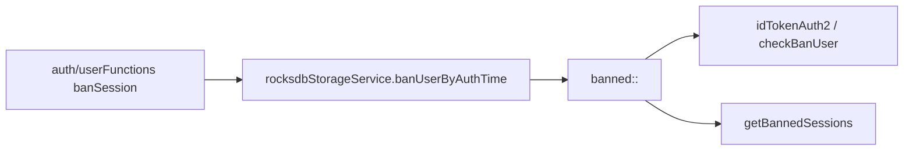

### `firestates/statesStorage`

- File `modules/firestates/storage.js` initializes RocksDB path `firestates/statesStorage`.
- `modules/firestates/firestatesModule.js` imports it as `FSSDB`, but no active call to `get/set/del` was found.
- Runtime source of truth is process memory:
  - `Map devs` keyed by `did`.
  - `incomeStateEvent` writes memory state from payload `{ did, code, elements }`.
  - `getstate` reads memory state and returns `{ did, time, states }`.

Open gap: PVC/GitOps path exists, but this module currently does not persist states to RocksDB.

### `geo/gsmStorage`

| Key | Writer | Reader | Payload |
|---|---|---|---|
| `gsm:<mcc>:<mnc>:<lac>:<cid>` | `geo/libs/export.js` imports GSM cell rows and writes `Storage.set(gsmkey, { lon, lat })` | `geo/libs/geoFunctions.js::find` exact lookup | `{ lon, lat }` |
| `gsm:<mcc>:<mnc>:<lac>` prefix | exact-key rows create this searchable prefix | `geoFunctions.find` fallback `getByPrefix(prefix, 0, 1)` | same `{ lon, lat }`; returned with lower accuracy |

Flow:

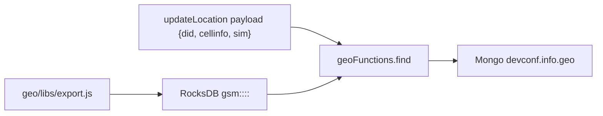

Mongo write from this module:

- Production: `DC.updateOne({ did }, { $set: { 'info.geo': bsGeo } })`.
- Optional dev DB: `DCDev.updateOne({ did }, { $set: { 'info.geo': bsGeo } })` when `GEO_DEV_MONGO_URL` is configured.
- In-memory cache: `TirasCache` key `geo:<did>` for short-lived lookup results.

### `ip2location/ipStorage`

| Key | Writer | Reader | Payload |
|---|---|---|---|
| `ipv4:<netUint32>:<mask>` | `ip2location/storageFunctions.js::storeAsnRecords`, driven by `importFile.js` | `findSubnet(ip)` mask scan | `{ startIp, endIp, net, mask, asn, org, asnu }` |
| `geo:ipv4:<netUint32>:<mask>` | `storeGeoRecords`, driven by `importFile.js` | `findSubnet(ip)` mask scan | `{ net, mask, cc, country, region, city, cidru }` |

Flow:

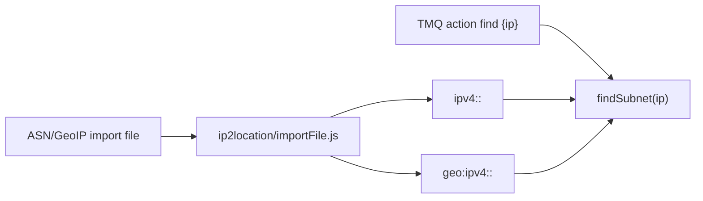

Notes:

- `findSubnet` searches masks from more specific to broader and merges first ASN and Geo match.
- `index.js` exposes TMQ/IPC actions `find`, `import`, and `write`.
- `checkTtl` scans `ttl:` keys, but this module does not appear to write local TTL entries.

### `notifyjournal/notifyStorage`

| Key | Writer | Reader | Payload |
|---|---|---|---|
| `un:<uid>:<notificationId>` | `setNotification` via actions `set`/`write` | `getNotifications`, `setRead`, `delNotification`, `clearNotifications` | `{ key, time, uid, status, notify }` |
| `ai:un:<uid>` | `rdbDriver.getAutoIncrementId('un', uid)` | writer-side only | `{ id }` counter for user notification IDs |
| `un:uc:<uid>` | `setCount(uid, +/-n)` | `getUnread` intended reader | `{ c, d }` count and timestamp |
| `sn:sent:<id>` | `setServerNotification` | `getServerNotifications` | `payload.notification` |
| `ai:servernotification:` | auto-increment | writer-side only | `{ id }` |
| `cn:sent:<id>` | `setConsoleNotification` | `getConsoleNotifications` | `payload.notification` |
| `ai:consolenotification:` | auto-increment | writer-side only | `{ id }` |

Flow:

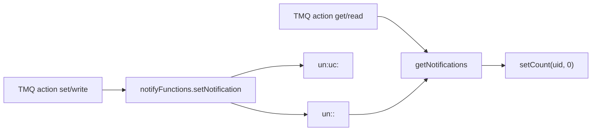

Important issue found:

- `getUnread(data)` builds `un:uc:${uid}`, but `uid` is not defined in that function scope; it should likely use `data.uid`. Current `unread` action can fail or read the wrong key.
- `clearNotifications` deletes `un:<uid>:` prefix but does not clearly clear `un:uc:<uid>`.

### `storemod/modulesStorage`

| Key | Writer | Reader | Payload |
|---|---|---|---|
| `module:<lowercaseSerial>` | `addModule`, called by `findAndSaveInConfig`, `loadFromConfigs`, TMQ action `write` | `findModule(sn)`, `findAllModules(sn)`, TMQ actions `find`/`get` | `{ v: [{ did, sn, code, u }], t: <expiresAtMs_or_0> }` |
| `ttl:<expiresAtMs>:module:<serial>` | `addModule` when ttl is passed | `checkTtl` | value is target key `module:<serial>` |

Flow:

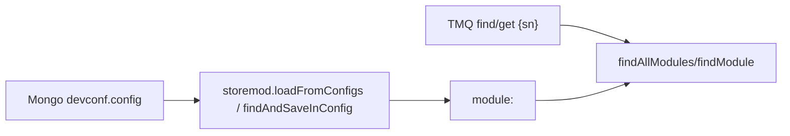

Notes:

- Source data comes from `config.modules[*].id/code` and `config.wrl[*].sn/code` in Mongo `devconf`.
- TTL here uses millisecond timestamps in the key name, independently from `rdbDriver` second-based `$ttl` envelope.

## Redis and Redis-like storage

### `modules/common/redis.js`

Real Redis wrapper used by modules that import `common/redis`.

- Config keys: `REDIS_HOST`, `REDIS_PORT`, `REDIS_PASSWD`, or corresponding redacted `config.json` fields.
- Opens pattern subscriber, reader, and writer clients.
- `set(key, value, expire)` stores `JSON.stringify(value)`, with optional `SETEX`.
- `get(key)` JSON-parses stored values.
- Array keys are joined with `:`.
- `listen(channel, cb)` uses `psubscribe(channel)`.

Known direct key:

| Key | Writer | Reader | Payload |
|---|---|---|---|
| `grafana_fire_devices` | `firegw/fireDeviceManager.js::setGrafanaLogsDevicesToRedis` | `getGrafanaLogsDevices` at startup/runtime | array of `{ did }` for devices selected for Grafana fire logs |

### Redis Pub/Sub IPC

Files: `modules/common/ipcredis.js`, `modules/common/ipc.js`, `modules/common/ologClient.js`, `modules/support/lib/ologClient.js`, `modules/support/lib/ologServer.js`, `modules/support/lib/ologService.js`.

| Channel | Writer | Reader | Payload |
|---|---|---|---|
| module name / custom channel | `ipcredis.send` / `ipc.send` | `listen`/`psubscribe` consumers | `ipcredis`: `{ from, payload, report?, reportPayloaded? }`; `ipc`: `{ from, action, method, payload }` |
| `ologserver` | OLog clients in gateway/onliner/udpnew/support direct client | `support/lib/ologServer.js` | event/log envelope or listener updates |
| `ologclient` | OLog server | OLog clients | `{ cmd: 'listen', data: { did: [...], email: [...] } }` |
| `fire-ologserver` | fire modules | fire OLog server | fire event/log envelope |
| `fire-ologclient` | fire OLog server | fire modules | fire listen list |

OLog event payload shape sent toward server:

```js
{
  timestamp,
  sender,
  did,      // optional
  email,    // optional
  message: JSON.stringify(data)
}
```

### `localRedis` JSON-file store

File: `modules/common/localRedis.js`.

- Not a Redis server.
- Persists a JSON object to a local file using `LR.init(filename)`.
- API: `get`, `set`, `del`, `keys`.

Known key:

| File | Key | Writer | Reader | Payload |
|---|---|---|---|---|
| `mailingList.tdb` | `mailings` | `spamer/senderModule.js::addMailingQueue`, `processMailing` | `processMailing` | array of `{ mid, uids, total, totalsent, subject, body, sent }` |

### `app_modded` Redis keyspace

Main files:

- `modules/app_modded/classes/rdb.js`
- `modules/app_modded/helpers/rdbfunc.js`
- `modules/app_modded/classes/userdata.js`
- `modules/app_modded/services/fcm/classes/userdata.js`
- `modules/app_modded/classes/devices.js`
- `modules/app_modded/classes/devicesService.js`
- `modules/app_modded/classes/onliners.js`

#### Identity, gadget, and FCM keys

| Key | Writer | Reader | Payload |
|---|---|---|---|
| `uids:<uid>` | `helpers/rdbfunc.setIdentityNew`, `classes/userdata.save`, FCM `userdata.save`, migration scripts | `getByUid`, `getByUids`, `getGadgetsByUids`, `getGadgetsByDidUids`, `onliners`, FCM service | user object with `uid`, optional `email`, `gadgets`, `dids`, `props` |
| `tokens:<token#>` | `setIdentityNew`, FCM `savetokenaux`; `#` replaces `:` in token | token lookup/delete helpers | `{ uid, uuid }` |
| `uuiddevices:<did>` hash field `<uuid>` | legacy `setIdentity` | legacy gadget lookup/delete helpers | gadget/device binding object `{ os, sw, rv, gadget, uuid, lang, token, srv, last, userid, did, bitmask }` |
| `fcmtokens:<token#>` hash field `<did>` | legacy `setIdentity` | FCM token cleanup / migration helpers | usually `<uuid>` or token-to-device marker |
| `fuuids:<did>_<uuid>` | legacy `setIdentity` | delete helpers | FCM token string |
| `suuids:<uuid>` | socket/session helpers | socket/session lookup helpers | session id, expires after about 300 seconds |

Typical `uids:<uid>` payload shape from current code:

```js
{
  uid,
  email,
  gadgets: {
    [uuid]: {
      type, swn, build, name, os, sw, rv, gadget, lang,
      token, srv, gs, ip, fbid, auth_time, last, deleted
    }
  },
  dids: {
    [did]: {
      userid, usertype, an, banned,
      props: {
        badge,
        notify: { mask, ah, ex },
        entrance: { ev },
        njb
      },
      us,
      granted
    }
  },
  props: {
    notify: { mask, ah, ex },
    entrance: { did },
    njb
  }
}
```

Writer -> reader flow:

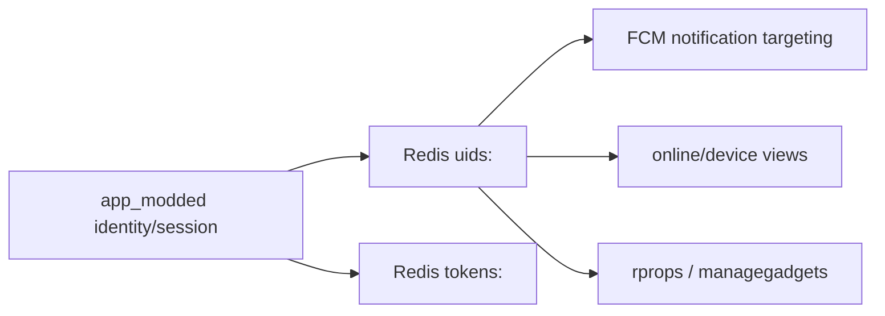

#### Attempts and sessions

| Key | Writer | Reader | Payload |
|---|---|---|---|
| `attempts:<did>` hash field `<userid>` | `setAttempts`, `resetAttempts`, legacy auth helpers | `getAttempts` | `{ banned, attempts, last }` |
| `sessions:<did>_<userid>` hash field `<uuid>` | `setSession` | `getSession`, `deleteSession`, reset helpers | session id string |
| `sskatch:<did>` hash field `<userid>` | `setSsKatch` | `getSsKatch`, `deleteSsKatch` | code/session-sketch value |

#### Device runtime state

| Key | Writer | Reader | Payload |
|---|---|---|---|
| `states:<did>` | `classes/devices.js`, `classes/devicesService.js` | same modules during load/reconnect | device state object/bitmasks |
| `onlines:last` | `setOnlines` | `getOnlines` on restart/runtime | online snapshot object |
| `semiofflines` hash field `<did>` | semi-offline handlers | semi-offline readers | `{ did, time }` |
| `installerrights:<did>` hash field `<userid>` | installer rights helpers | installer rights readers | `{ state, fromuid, touid, amount, to }` |

#### Generic app_modded Redis hash repository

Files: `classes/services/redisDB.js` and FCM duplicate.

| Key | Writer | Reader | Payload |
|---|---|---|---|
| `<hashName>` hash field `<id>` | `save(hashName, id, data)` | `find`, `findAll` | `{ refId, ...data, id, ts }` |
| `<hashName>_refId` hash field `<refId>` | `save` when `refId` exists | `findByRefId` | `<id>` |

Note: wrapper/export mismatch around `getId` should be checked before treating this as reliable production storage.

#### Legacy duplicate keys

`modules/app_modded/rdbfunc.js` still references older key shapes:

| Key | Role |
|---|---|
| `did_<did>` hash field `<token_>` | older device-token map |
| `fcm:<token_>` hash field `<did>` | older token-device reverse map |
| `attempts:<did>`, `sessions:<did>_<userId>` | older auth/session helpers, overlap with newer helpers |

Migration/diagnostic scripts (`correctah.js`, `dso.js`, `migratefcm.js`) scan or rewrite `uids:*`, `uuiddev*`, and related legacy data.

## MongoDB / Mongoose

### Main schema source

Primary file: `modules/common/models/schemas.js`.
Support duplicate: `modules/support/lib/common/models/schemas.js`.

The support duplicate mostly mirrors the main schema but exports `FDEV = mongoose.model('firedevice', device)` instead of the dedicated `firedevice` schema. Main schema exports `FDEV` with `firedevice` schema.

### Primary collections and schema fields

| Export | Collection | Schema fields |
|---|---|---|
| `counter` | `counter` | `_id`, `seq` |
| `USER` | `user` | `_id`, `email`, `phone`, `fbid`, `name`, `privileges`, `alias`, `lastaction`, `passwordHash`, `passwordSalt`, `act_date`, `act_code`, `act_date_phone`, `act_code_phone`, `confirmed_phone`, `confirmed_email`, `block_date`, `confirmgpdr`, `status`, `created`, `more`, `lastLogin`, `updated` |
| `DEV` | `device` | `_id`, `did`, `dkey`, `dtype`, `color`, `srv`, `s`, `ban`, `c` |
| `DC` | `devconf` | `_id`, `did`, `config`, `actual`, `info`, `crcs`, `s`, `u`, `lo` |
| `DS` | `devsetting` | `did`, `props`, `settings`, `u` |
| `SRV` | `server` | `_id`, `name`, `alias`, `ip`, `port`, `type`, `active`, `comment`, `c` |
| `DTYPE` | `devtype` | `_id`, `name`, `locale`, `ppc`, `description`, `type`, `comment`, `c` |
| `FW` | `firmware` | `_id`, `fid`, `file`, `ppc`, `hw`, `sw`, `rev`, `priority`, `build`, `crc`, `size`, `description`, `description2`, `active`, `uploadedby`, `date` |
| `CF` | `configfile` | `did`, `filein`, `fileout`, `crc`, `sizein`, `sizeout`, `datein`, `dateout`, `description`, `modifiedby`, `updated` |
| `RIGHTS` | `devright` | `did`, `uid`, `userid`, `iid`, `settings`, `comment`, `u` |
| `JRNL` | `journal` | `did`, `code`, `objid`, `mid`, `uid`, `acc`, `elements`, `ch`, `timestamp`, `lt`, `ld`, `date`, `stime`, `dtime` |
| `SJ` | `servicejournal` | `uid`, `email`, `act`, `te`, `eid`, `ip`, `msg`, `date` |
| `LF` | `logfile` | `did`, `file`, `crc`, `size`, `uid`, `datein` |
| `OS` | `onlinestat` | `totalOnline`, `totalFireOnline`, `firmwaresVersions`, `devicesTypes`, `firmwaresFireVersions`, `devicesFireTypes`, `unknownDevices`, `timestamp` |
| `LOGS` | `log` | `proc`, `date`, `body` |
| `FINST` | `finst` | `did`, `uid`, `date`, `info` |
| `TICKETS` | `ticket` | `_id`, `c`, `u`, `title`, `phone`, `email`, `name`, `did`, `uid`, `priority`, `at`, `status`, `cat`, `own`, `aff`, `messages` |
| `NJ` | `notifyjournal` | `uid`, `date`, `notify`, `a`, `r`, `t` |
| `REPORT` | `report` | `uid`, `title`, `rt`, `report`, `c` |
| `FC` | `fireconf` | `_id`, `did`, `config`, `actual`, `info`, `crcs`, `s`, `u`, `lo` |
| `FIRESET` | `firesetting` | `did`, `props`, `settings`, `u` |
| `FIREJRNL` | `firejournal` | `did`, `code`, `objid`, `mid`, `uid`, `acc`, `elements`, `ch`, `timestamp`, `lt`, `ld`, `date`, `stime`, `dtime` |
| `FS` | `firestorage` | `type`, `uri`, `preview`, `date`, `info` |
| `FDEV` | `firedevice` | `_id`, `did`, `dkey`, `dtype`, `color`, `srv`, `s`, `ban`, `c` |
| `FIRERIGHTS` | `fireright` | `did`, `uid`, `userid`, `iid`, `settings`, `comment`, `u` |

### Additional Mongo schemas outside main common file

| File | Collection/export | Fields / role |
|---|---|---|
| `geo/libs/schema.js` | `CELL` -> `cell` | `mcc`, `mnc`, `lac`, `cid`, `lon`, `lat`, `c`, `u` |
| `geo/libs/DCdevSchema.js` | `DCDev` -> `devconf` on optional dev connection | `_id`, `did`, `config`, `actual`, `info`, `crcs`, `s`, `u`, `lo` |
| `tgsupportbot/libs/schemas.js` | `SUSER` -> `support_user` | `_id`, `id`, `from`, `uid`, `u`, `cs`, `date`, `dialogid`, `active`, `new`, `lastupdate`, `lastmsg`, `ban`, `im` |
| `tgsupportbot/libs/schemas.js` | `SMSG` -> `support_message` | `userid`, `srv`, `msg`, `cs`, `date`, `dialogid`, `im` |
| `tgsupportbot/libs/schemas.js` | `USER` -> `user` | auth/user-like fields: `_id`, `email`, `phone`, `fbid`, `name`, `privileges`, auth confirmation/status dates |
| `common/models/device.js` | legacy `Device`, `UDEV`, `DEVU` | old device/user-device maps: `did`, `key`, `installkey`, `status`, `config`, `additionalinfo`, `uid`, `devices`, `users`, `created` |
| `common/models/deviceSchema.js` | legacy `Device`, `UDEV`, `DEVU`, `DevConfig` | older `_id/did/installkey/defaultserver/status/created` shape |
| `common/models/user.js` | legacy `User` | `email`, `phone`, `name`, `privileges`, password/confirmation/status fields |
| `emulator/schemas.js`, `journal/emulator/schemas.js` | emulator duplicates | older copies of user/device/devconf/devsettings/firmware/configfile/server/devtype/devright/journal/servicejournal/logfile |

### Mongo writer/reader map by collection

| Collection | Writers | Readers | Payload / important fields |
|---|---|---|---|
| `user` | `auth/userFunctions.js` registration/login/profile updates; support user admin routes; tgsupportbot lookups do not normally mutate main user except support privileges routes | `auth`, `device/permisionFunctionsNew`, `support/routes/users`, `spamer`, `tgsupportbot`, notification/mail helpers | identity: `email`, `phone`, `fbid`, `name`; auth status: `passwordHash`, `passwordSalt`, confirmation fields, `status`; permissions: `privileges`; preferences: `more` |
| `device` | `device/deviceFunctionsNew.js`, fire/device managers, support device actions | gateway/firegw/device/support routes | `did`, key/server/status fields: `dkey`, `srv`, `s`, `ban`, `c`, `dtype` |
| `devconf` | `device/deviceFunctionsNew`, `udpnew/classes/configClass`, `udpnew/events/protoV2/V3`, `geo/libs/geoFunctions`, gateway/onliner update `lo` | gateway device manager, udpnew middleware, storemod loader, support devices/reports/statistics | `config` full device config; `info` runtime metadata such as `geo`, `tz`, `sim*`, `ver`; `crcs`, `actual`, `u`, `lo` |
| `devsetting` | device setting/update flows, support/device routes | device/support/fire-device routes | `settings`, `props`, `did`, `u` |
| `devright` | `device/permisionFunctionsNew`, `udpnew/libs/fillConfig`, support device user actions | auth duplicate-user cleanup, device/user lookup, support mailer/reports, store/config flows | `did`, `uid`, `userid`, `iid`, `settings`, `comment`, `u` |
| `journal` | `gateway/onlinerNew.js`, `udpnew/events/protoV2/V3`, journal service | journal API, support API/statistics/device profile | event payload: `did`, `code`, `objid`, `mid`, `uid`, `acc`, `elements`, `ch`, `timestamp`, location/time fields |
| `firejournal` | `firegw/events/protoV3.js`, fireudp event handlers | firejournal service, support fire-device routes | same event shape as `journal`, fire domain |
| `firmware` | support firmware admin routes | firmware provider, udpnew/fireudp config checks, device/support routes | firmware identity/version: `ppc`, `hw`, `sw`, `rev`, `build`, `priority`, `crc`, `size`, `file` |
| `configfile` | support loader routes, udpnew/fireudp config upload flows | support loader/device routes, device update flows | input/output config files and CRC/size/date metadata |
| `logfile` | udpnew/fireudp log upload flows, support device actions | support device profile/file routes | uploaded log metadata: `did`, `file`, `crc`, `size`, `uid`, `datein` |
| `onlinestat` | `support/lib/statisticsService.js` | support statistics/API routes | online counters, firmware/device type distributions, timestamp |
| `log` | `mailer/index.js`, support/system tools audit records | support API/system log routes | `proc`, `date`, `body` |
| `finst` | device permission/invite flows | permission/support flows | first-install/invite metadata: `did`, `uid`, `date`, `info` |
| `ticket` | support ticket routes | support ticket/device/user routes | ticket envelope and `messages` thread |
| `notifyjournal` | legacy Mongo notification routes | journal/firejournal/support notification history | `uid`, `date`, `notify`, ack/read/type flags; separate from RocksDB `notifyjournal` service |
| `report` | support report generation routes | support report list/detail routes | generated report body keyed by `rt`, `uid`, `title`, `c` |
| `fireconf` | fireudp config class, fire/device flows | firegw/fireudp/support fire-device routes | fire device config and `info`, same high-level role as `devconf` |
| `firesetting` | main common schema only; direct usage sparse | fire setting consumers if wired | `did`, `props`, `settings`, `u` |
| `firedevice` | `firegw/fireDeviceManager.js`, support fire-device actions | firegw/support/fire modules | fire device identity/status fields: `did`, `dkey`, `srv`, `s`, `ban`, `c`, `dtype` |
| `fireright` | support fire-device user actions, fire config flows | support user/fire-device routes | fire device user rights, same shape as `devright` |
| `firestorage` | support notification/media routes | support notification/media routes | uploaded media: `type`, `uri`, `preview`, `date`, `info` |
| `cell` | geo import tooling | `geo/find.js` legacy lookup | GSM cell row: `mcc`, `mnc`, `lac`, `cid`, `lon`, `lat` |
| `support_user` | tgsupportbot user manager | tgsupportbot support/user managers | Telegram support dialog state and linkage to platform `uid` |
| `support_message` | tgsupportbot message manager | tgsupportbot message manager | Telegram support messages and imported message metadata |

### Field-level highlights from code

- `user.fbid`, `user.email`, `user.phone`, `user.name`: read/write in `auth/userFunctions.js` during Firebase login, duplicate merge, registration, profile/recovery flows.
- `user.privileges`: read in auth/support/tgsupportbot; support routes write support privilege fields.
- `user.more`: read by auth/support/spamer; `spamer` checks subscription-like fields under `more`.
- `devconf.config`: written by device/udp config flows; read by gateway, udpnew, storemod, support reports, support device profile.
- `devconf.info.geo`: written by `geo/libs/geoFunctions.js`; read by support geolocation/statistics APIs.
- `devconf.info.tz`: read by `udpnew/libs/middleWare.js` for timezone fallback.
- `devconf.info.sim1/sim2`: written by `udpnew/events/protoV2/V3` SIM update handlers.
- `devconf.lo`: written by `gateway/onlinerNew.js` as last-online-like timestamp; read by support/device views.
- `devright.uid/userid/settings`: written by permission and config fill flows; read by auth duplicate cleanup, device access, support mailer and device/user views.
- `journal.*` and `firejournal.*`: event writers save full event records; support and journal services query by `did`, `date`, `code`, and other event metadata.
- `firmware.file` is deliberately excluded in some support reads (`{ file: 0 }`) and read only when needed for download/admin flows.

## Cross-storage flows

### Auth / identity

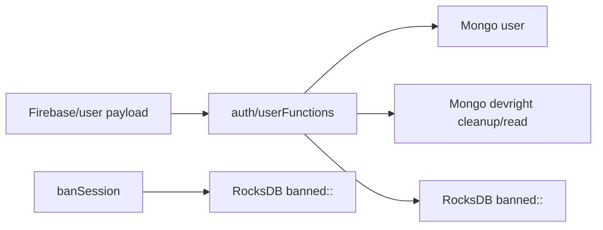

### Device config to module lookup

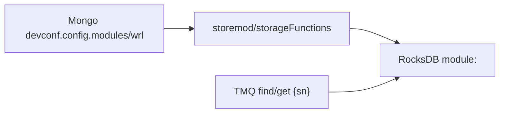

### Geo enrichment

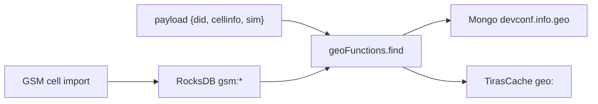

### Notifications

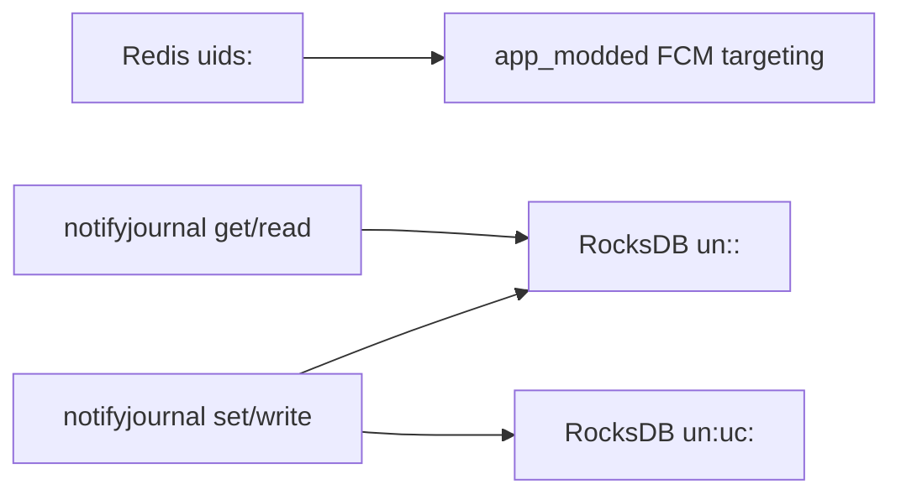

### Fire device monitoring/logging

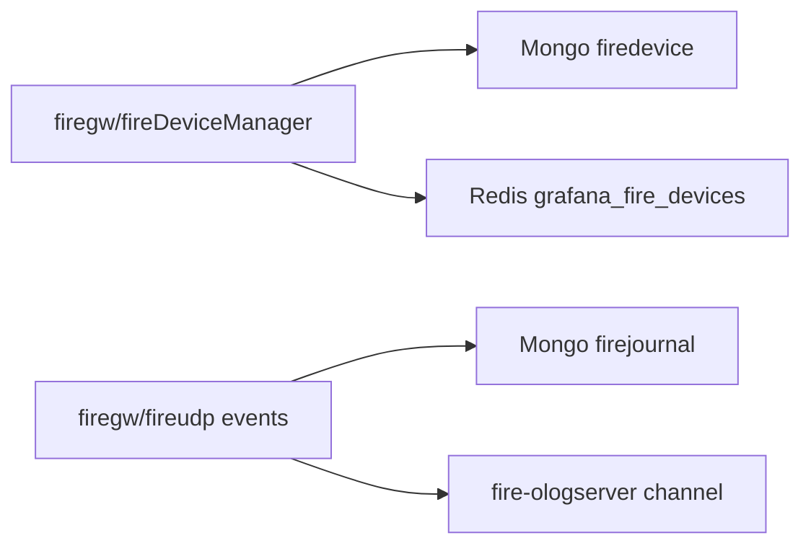

## Open questions / risks found

1. `auth` has reader `sessions:<fbId>`, but no writer was found in the scanned repo. Either this is legacy/external writer or dead code.
2. `firestates` provisions RocksDB storage but does not persist state in active service code; runtime state is in-memory only.
3. `__meta:rocksdb:indexVersion` is required by the migration checklist but not implemented in the service storage files found here.
4. `notifyjournal.getUnread` appears to use undefined `uid` instead of `data.uid`.
5. `rdbDriver.get` unwraps `$value` before checking `value.$ttl`; expired envelopes may not be handled as intended in all read paths.
6. `storemod` and `ip2location` contain local `ttl:` scanning logic that is separate from `rdbDriver`'s `$ttl`/`ttl:<seconds>` mechanism; units differ in `storemod` (`Date.now()` milliseconds).
7. `app_modded` has multiple generations of Redis schema (`uids:*` current-ish, `uuiddevices:*`/`fcmtokens:*`, and older `did_*`/`fcm:*`). Migration scripts still touch legacy shapes.
8. `support/lib/common/models/schemas.js` exports `FDEV` using the `device` schema while the main common schema uses the dedicated `firedevice` schema.
9. `geo/libs/mongo.json` contains connection configuration in the repo tree; do not copy values into docs or CI logs. Prefer env/Secret wiring.

## Quick lookup: who writes -> who reads -> payload

| Storage | Writer | Reader | Payload |
|---|---|---|---|
| RocksDB `banned:<fbId>:<authTime>` | `auth banSession` | `auth idTokenAuth2`, `getBannedSessions` | `{ fbid, auth_time, bantime }` |
| RocksDB `gsm:<mcc>:<mnc>:<lac>:<cid>` | `geo export/import` | `geo updateLocation/find` | `{ lon, lat }` |
| RocksDB `ipv4:<netUint32>:<mask>` | `ip2location import ASN` | `ip2location findSubnet` | ASN/org/net data |
| RocksDB `geo:ipv4:<netUint32>:<mask>` | `ip2location import Geo` | `ip2location findSubnet` | country/region/city/net data |
| RocksDB `un:<uid>:<id>` | `notifyjournal set/write` | `notifyjournal get/read/setread/del` | user notification envelope |
| RocksDB `module:<serial>` | `storemod load/write` | `storemod find/get` | `{ v:[{did,sn,code,u}], t }` |
| Redis `grafana_fire_devices` | `firegw setGrafanaLogsDevicesToRedis` | `firegw getGrafanaLogsDevices` | `[{ did }]` |
| Redis `uids:<uid>` | app_modded identity/userdata | app_modded FCM/onliner/gadget flows | user/gadgets/dids/preferences object |
| Redis `tokens:<token#>` | app_modded identity/FCM | token lookup/delete helpers | `{ uid, uuid }` |
| Redis `states:<did>` | app_modded devices | app_modded devices on load/runtime | device states |
| Redis `onlines:last` | app_modded onliners/devices | app_modded restart/runtime | online snapshot |
| localRedis `mailings` | `spamer startMailing/processMailing` | `spamer processMailing` | mailing queue array |
| Mongo `devconf.info.geo` | `geo updateLocation` | support geolocation/statistics APIs | `{ accu, lat, lon }` plus lookup result |
| Mongo `journal` | gateway/udpnew event flows | journal/support APIs | event record |
| Mongo `firejournal` | firegw/fireudp event flows | firejournal/support APIs | fire event record |
## Unified Data Relationship Diagram

Єдина Mermaid-схема нижче зводить основні взаємозв'язки між модулями, RocksDB, Redis/Redis-like, MongoDB collections і похідними payload-ами. Пунктиром позначено provisioned/ризикові або неактивні зв'язки з коду.

```mermaid
flowchart LR
  subgraph Entry["Modules / services"]
    Auth["auth"]
    App["app_modded"]
    Device["device"]
    Gateway["gateway"]
    UDP["udpnew"]
    FireUDP["fireudp"]
    FireGW["firegw"]
    FireStates["firestates"]
    Geo["geo"]
    IP2["ip2location"]
    Notify["notifyjournal"]
    StoreMod["storemod"]
    Support["support"]
    Spamer["spamer"]
    TgBot["tgsupportbot"]
    Mailer["mailer"]
    JournalSvc["journal"]
    FireJournalSvc["firejournal"]
    FirmwareSvc["firmware"]
    Onliner["onliner"]
  end

  subgraph Messaging["Messaging / PubSub"]
    TMQ["tirasmq / ipc actions"]
    OLog["OLog channels\nologserver/ologclient\nfire-ologserver/fire-ologclient"]
    RedisPubSub["Redis Pub/Sub IPC"]
  end

  subgraph RedisStore["Redis / Redis-like"]
    R_Uids["Redis uids:<uid>"]
    R_Tokens["Redis tokens:<token#>"]
    R_UUIDDevices["Redis hash uuiddevices:<did>"]
    R_FCMTokens["Redis hash fcmtokens:<token#>"]
    R_Sessions["Redis hash sessions:<did>_<userid>"]
    R_Attempts["Redis hash attempts:<did>"]
    R_States["Redis states:<did>"]
    R_Onlines["Redis onlines:last"]
    R_Semi["Redis hash semiofflines"]
    R_Installer["Redis hash installerrights:<did>"]
    R_Grafana["Redis grafana_fire_devices"]
    LR_Mailings["localRedis mailingList.tdb\nkey: mailings"]
    Cache["TirasCache in-memory\ngeo/stats/devrights/etc."]
  end

  subgraph RocksDB["RocksDB"]
    RDB_Banned["auth banned:<fbId>:<authTime>"]
    RDB_Sessions["auth sessions:<fbId>\nreader-only in repo"]
    RDB_GSM["geo gsm:<mcc>:<mnc>:<lac>:<cid>"]
    RDB_ASN["ip2location ipv4:<netUint32>:<mask>"]
    RDB_GeoIP["ip2location geo:ipv4:<netUint32>:<mask>"]
    RDB_Notify["notifyjournal un:<uid>:<id>"]
    RDB_Unread["notifyjournal un:uc:<uid>"]
    RDB_ServerNotify["notifyjournal sn:sent:<id> / cn:sent:<id>"]
    RDB_Module["storemod module:<serial>"]
    RDB_FireStates["firestates statesStorage\nprovisioned, not used by active code"]
  end

  subgraph MongoDB["MongoDB collections"]
    M_User["user"]
    M_Device["device"]
    M_DevConf["devconf"]
    M_DevSetting["devsetting"]
    M_DevRight["devright"]
    M_Journal["journal"]
    M_ServiceJournal["servicejournal"]
    M_Firmware["firmware"]
    M_ConfigFile["configfile"]
    M_LogFile["logfile"]
    M_OnlineStat["onlinestat"]
    M_Log["log"]
    M_FInst["finst"]
    M_Ticket["ticket"]
    M_NotifyJournal["notifyjournal\nlegacy Mongo"]
    M_Report["report"]
    M_FireConf["fireconf"]
    M_FireSetting["firesetting"]
    M_FireJournal["firejournal"]
    M_FireStorage["firestorage"]
    M_FireDevice["firedevice"]
    M_FireRight["fireright"]
    M_Cell["cell"]
    M_SupportUser["support_user"]
    M_SupportMessage["support_message"]
  end

  subgraph Payloads["Derived payloads / consumers"]
    FCM["FCM targeting / push payloads"]
    DeviceConfig["Device config payload"]
    GeoPayload["Geo payload\n{accu, lat, lon}"]
    IPPayload["IP payload\nASN + country/region/city"]
    Notifications["Notification payloads"]
    SupportViews["Support UI/API views"]
    Mailing["Email/mailing payloads"]
    OLogConsumers["Realtime OLog websocket clients"]
  end

  Auth --> M_User
  Auth --> M_DevRight
  Auth --> RDB_Banned
  RDB_Banned --> Auth
  RDB_Sessions -.-> Auth

  App --> R_Uids
  App --> R_Tokens
  App --> R_UUIDDevices
  App --> R_FCMTokens
  App --> R_Sessions
  App --> R_Attempts
  App --> R_States
  App --> R_Onlines
  App --> R_Semi
  App --> R_Installer
  R_Uids --> App
  R_States --> App
  R_Onlines --> App
  R_Uids --> FCM
  R_Tokens --> FCM
  R_UUIDDevices --> FCM
  R_FCMTokens --> FCM

  Device --> M_Device
  Device --> M_DevConf
  Device --> M_DevSetting
  Device --> M_DevRight
  Device --> M_Firmware
  Device --> M_ConfigFile
  Device --> M_LogFile
  Device --> M_FInst
  M_DevConf --> DeviceConfig
  M_DevSetting --> DeviceConfig
  M_DevRight --> DeviceConfig
  M_Firmware --> DeviceConfig
  M_ConfigFile --> DeviceConfig

  Gateway --> M_Device
  Gateway --> M_DevConf
  Gateway --> M_Journal
  Gateway --> OLog
  UDP --> M_DevConf
  UDP --> M_DevSetting
  UDP --> M_DevRight
  UDP --> M_Journal
  UDP --> M_Firmware
  UDP --> M_ConfigFile
  UDP --> M_LogFile
  UDP --> OLog
  Onliner --> OLog
  JournalSvc --> M_Journal

  FireGW --> M_FireDevice
  FireGW --> M_FireConf
  FireGW --> M_FireJournal
  FireGW --> R_Grafana
  R_Grafana --> FireGW
  FireGW --> OLog
  FireUDP --> M_FireConf
  FireUDP --> M_FireRight
  FireUDP --> M_FireJournal
  FireUDP --> M_Firmware
  FireUDP --> M_ConfigFile
  FireUDP --> M_LogFile
  FireUDP --> OLog
  FireJournalSvc --> M_FireJournal

  FireStates --> TMQ
  TMQ --> FireStates
  FireStates -. runtime memory only .-> RDB_FireStates

  Geo --> RDB_GSM
  RDB_GSM --> Geo
  Geo --> GeoPayload
  GeoPayload --> M_DevConf
  Geo --> M_Cell
  M_Cell --> Geo
  Geo --> Cache

  IP2 --> RDB_ASN
  IP2 --> RDB_GeoIP
  RDB_ASN --> IPPayload
  RDB_GeoIP --> IPPayload
  TMQ --> IP2

  Notify --> RDB_Notify
  Notify --> RDB_Unread
  Notify --> RDB_ServerNotify
  RDB_Notify --> Notifications
  RDB_Unread --> Notifications
  RDB_ServerNotify --> Notifications
  TMQ --> Notify

  StoreMod --> M_DevConf
  M_DevConf --> StoreMod
  StoreMod --> RDB_Module
  RDB_Module --> StoreMod
  TMQ --> StoreMod

  Support --> M_User
  Support --> M_Device
  Support --> M_DevConf
  Support --> M_DevSetting
  Support --> M_DevRight
  Support --> M_Journal
  Support --> M_ServiceJournal
  Support --> M_Firmware
  Support --> M_ConfigFile
  Support --> M_LogFile
  Support --> M_OnlineStat
  Support --> M_Log
  Support --> M_Ticket
  Support --> M_NotifyJournal
  Support --> M_Report
  Support --> M_FireConf
  Support --> M_FireSetting
  Support --> M_FireDevice
  Support --> M_FireRight
  Support --> M_FireJournal
  Support --> M_FireStorage
  Support --> Cache
  Support --> OLog
  OLog --> OLogConsumers
  OLogConsumers --> SupportViews
  M_User --> SupportViews
  M_Device --> SupportViews
  M_DevConf --> SupportViews
  M_Journal --> SupportViews
  M_FireJournal --> SupportViews
  M_Ticket --> SupportViews
  Cache --> SupportViews

  Spamer --> LR_Mailings
  LR_Mailings --> Spamer
  Spamer --> M_User
  M_User --> Mailing

  TgBot --> M_SupportUser
  TgBot --> M_SupportMessage
  TgBot --> M_User
  M_SupportUser --> TgBot
  M_SupportMessage --> TgBot

  Mailer --> M_Log
  FirmwareSvc --> M_Firmware
  FirmwareSvc --> M_DevConf

  RedisPubSub --> TMQ
  TMQ --> Auth
  TMQ --> Geo
```
